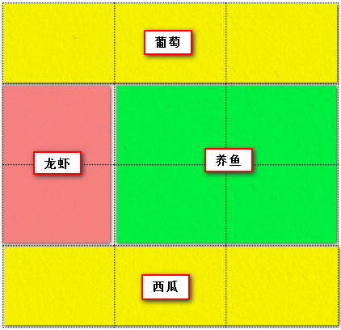
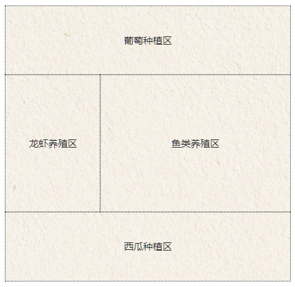
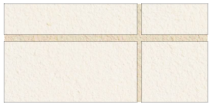
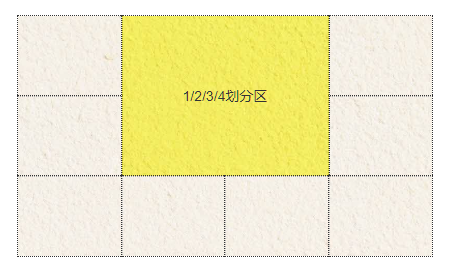

# 资源

- [阮一峰](http://www.ruanyifeng.com/blog/2019/03/grid-layout-tutorial.html)

- [张鑫旭](https://www.zhangxinxu.com/wordpress/2018/11/display-grid-css-css3/)
- [MDN-网格布局的基本概念](https://developer.mozilla.org/zh-CN/docs/Web/CSS/CSS_Grid_Layout/Basic_Concepts_of_Grid_Layout)

- **[grid layout 和其它布局方法的联系
](https://developer.mozilla.org/zh-CN/docs/Web/CSS/CSS_Grid_Layout/Relationship_of_Grid_Layout)**

##  概念

### 行 和 列  真正的二维布局，行和列交叉产生网格，划分网格的线叫做网格线，水平网格线划出行，垂直网格线划出列。

## 属性

### 新增

  - 支持repeat(),划分规律网格时 `repeat(3, 1fr)`
  - 支持minmax(),产生一个长度范围 `minmax(100px, auto)`
  - 单位新增fr（fraction） 分数 分空间

### GRID容器属性

  - 网格命名（划区域）
   `grid-template-columns、grid-template-rows  <track-size> ... | <line-name><track-size>...`
    - 支持命名、双命名（考虑到网格有些边界共用）
  - 网格区域（分资源） `grid-template-areas: "<grid-area-name> | . |none | ..." "...";`
    - grid-area-name: 对应网格区域的名称
    - . 表示空的网格单元格
    - none 没有定义网格区域
    - 示例
    ```html
    //画图纸
      <div class="container">
        <div class="putao"></div>
        <div class="longxia"></div>
        <div class="yangyu"></div>
        <div class="xigua"></div>
      </div>
    ```
    ```css 
    // 划区域
    .container {
      grid-template-columns: 1fr 1fr 1fr;
      grid-template-rows: 1fr 1fr 1fr 1fr;
      grid-template-areas: 
          "葡萄 葡萄 葡萄"
          "龙虾 养鱼 养鱼"
          "龙虾 养鱼 养鱼"
          "西瓜 西瓜 西瓜";
        }
    ```
    ```css 
      // 分资源
      .putao { grid-area: 葡萄; }
      .longxia { grid-area: 龙虾; }
      .yangyu { grid-area: 养鱼; }
      .xigua { grid-area: 西瓜; }
    ```
    - 效果
    <div align=center>
      
      
    </div>

    - 注意

      如果我们给网格区域命了名，但是没有给网格线命名，则会自动根据网格区域名称生成网格线名称，规则是区域名称后面加-start和-end。例如，某网格区域名称是“葡萄”，则左侧column线名称就是“葡萄-start”，左侧column线名称就是“葡萄-end”。以及，我们的网格区域一定要形成规整的矩形区域，什么L形，凹的或凸的形状都是不支持的，会认为是无效的属性值。
  - grid-template `grid-template`是`grid-template-rows`，`grid-template-columns`和`grid-template-areas`属性的缩写。
    - 语法 
    ```css
    .container {
          grid-template: none;
      }
      // 其中none表示将3个CSS属性都设置为初始值。
      .container {
          grid-template: <grid-template-rows> / <grid-template-columns>;
      }
    ```
    - 示例  上面的例子可以缩写成：
    ```css
      .container {
      grid-template: 
          "葡萄 葡萄 葡萄" 1fr 
          "龙虾 养鱼 养鱼" 1fr 
          "龙虾 养鱼 养鱼" 1fr 
          "西瓜 西瓜 西瓜" 1fr
          /1fr 1fr 1fr;
      }
    ```
    - 注意

      由于`grid-template`不会重置一些隐式的grid属性（如`grid-auto-columns`，`grid-auto-rows`和`grid-auto-flow`），因此，大多数时候，还是推荐使用`grid`代替`grid-template`
  - grid-column-gap和grid-row-gap, `grid-column-gap`和`grid-row-gap`属性用来定义网格中网格间隙的尺寸。你可以理解成田地之间走路的田垄宽度。
    - 语法
    ```css
    .container {
      grid-column-gap: <line-size>;
      // <line-size>;  网格间的间隙尺寸。
      grid-row-gap: <line-size>;
    }
    ```
    - 示例
    ```css
    // 给定一个简单的2×2网格，设置水平网格间隙10px，垂直方向15px
    .container {
      grid-template-columns: 2fr 1fr;
      grid-template-rows: 1fr 2fr;
      grid-column-gap: 10px;
      grid-row-gap: 15px;
    }
    ```
    <div align=center>
    
    </div>

    - 缩写 grid-gap
    ```css
      .container {
      grid-gap: <grid-row-gap> <grid-column-gap>;
      }
    ```
  - justify-items `justify-items`指定了网格元素的水平呈现方式，是水平拉伸显示，还是左中右对齐
    - 语法
      ```css
        .container {
          justify-items: stretch | start | end | center;
        }
      ```
      - stretch 默认值，拉伸。表现为水平填充。
      - start 表现为网格水平尺寸收缩为内容大小，同时沿着网格线左侧对齐显示（假设文档流方向没有变）。
      - end 表现为网格水平尺寸收缩为内容大小，同时沿着网格线右侧对齐显示（假设文档流方向没有变）。
      - center 表现为网格水平尺寸收缩为内容大小，同时在当前网格区域内部水平居中对齐显示（假设文档流方向没有变）。
    - ['点击查看效果'](https://www.zhangxinxu.com/wordpress/2018/11/display-grid-css-css3/#justify-items)
  - align-items `algin-items`指定了网格元素的垂直呈现方式，是垂直拉伸显示，还是上中下对齐
    - 语法
      ```css
      .container {
        align-items: stretch | start | end | center;
      }
      ```
      - stretch 默认值，拉伸。表现为垂直填充。
      - start 表现为网格垂直尺寸收缩为内容大小，同时沿着上网格线对齐显示。
      - end 表现为网格垂直尺寸收缩为内容大小，同时沿着下网格线对齐显示。
      - center 表现为网格垂直尺寸收缩为内容大小，同时在当前网格区域内部垂直居中对齐显示。
    - ['点击查看效果'](https://www.zhangxinxu.com/wordpress/2018/11/display-grid-css-css3/#align-items)
  - place-items `place-items`可以让`align-items`和`justify-items`属性写在单个声明中。
    - 语法
      ```css
      .container {
          place-items: <align-items> / <justify-items>;
          // “合纵连横”的意味，纵在前，横在后，
      }
      ```
  - justify-content `justify-content`指定了网格元素的水平分布方式。**此属性仅在网格总宽度小于grid容器宽度时候有效果**
    - 语法
      ```css
      justify-content: stretch | start | end | center | space-between | space-around | space-evenly;
      ```
      - stretch 默认值。拉伸，宽度填满grid容器，拉伸效果需要网格目标尺寸设为auto时候才有效，如果定死了宽度，则无法拉伸。
      - start 默认值。逻辑CSS属性值，与文档流方向相关。默认表现为左对齐。
      - end 逻辑CSS属性值，与文档流方向相关。默认表现为右对齐。
      - center 表现为居中对齐。
      - space-between 表现为两端对齐。between是中间的意思，意思是多余的空白间距只在元素中间区域分配
      - space-around around是环绕的意思，意思是每个flex子项两侧都环绕互不干扰的等宽的空白间距，最终视觉上边缘两侧的空白只有中间空白宽度一半。
      - space-evenly evenly是匀称、平等的意思。也就是视觉上，每个flex子项两侧空白间距完全相等。
    - 示例
    我们网格设定的都是固定的宽度值，结果还有剩余空间。例如,此时，水平和垂直方向都有100px的剩余
      ```css
        .container {
            display: grid;
            width: 300px;
            grid-template: 100px 100px/100px 100px;
        }
      ```
    - ['查看示例'](https://www.zhangxinxu.com/wordpress/2018/11/display-grid-css-css3/#justify-content)
  - align-content `align-content`可以看成和`justify-content`是相似且对立的属性，`justify-content`指明水平方向`grid`子项的分布方式，而`align-content`则是指明垂直方向每一行`grid`元素的分布方式。如果所有`grid`子项只有一行，则`align-content`属性是没有任何效果的。
    - 语法
      ```css
      align-content: stretch | start | end | center | space-between | space-around | space-evenly;
      ```
      - tretch 默认值。每一行flex子元素都等比例拉伸。例如，如果共两行flex子元素，则每一行拉伸高度是50%。
      - start 逻辑CSS属性值，与文档流方向相关。默认表现为顶部堆砌。
      - end 逻辑CSS属性值，与文档流方向相关。默认表现为底部堆放。
      - center 表现为整体垂直居中对齐。
      - space-between 表现为上下两行两端对齐。剩下每一行元素等分剩余空间。
      - space-around 每一行元素上下都享有独立不重叠的空白空间。
      - space-evenly 每一行元素都完全上下等分。
    - ['查看示例'](https://www.zhangxinxu.com/wordpress/2018/11/display-grid-css-css3/#align-content)
  - place-content `place-content`可以让`align-content`和`justify-content`属性写在一个CSS声明中，也就是俗称的缩写
    - 语法
    ```CSS
    .container {
      place-items: <align-content> / <justify-content>;
      }
    ```
  - TODO:grid-auto-columns和grid-auto-rows 指定任何自动生成的网格轨道（也称为隐式网格轨道）的大小。 当网格项目多于网格中的单元格或网格项目放置在显式网格之外时，将创建隐式轨道。
  - grid-auto-flow `grid-auto-flow`属性控制没有明确指定位置的`grid`子项的放置方式。比方说定义了一个5*2的10格子，共有5个元素，其中2个元素指定了放在哪个格子里，还有3个则自生自灭排列。此时，这3个元素如何排列就是由`grid-auto-flow`属性控制的。
    - 语法
      ```css
      .container {
        grid-auto-flow: row | column | row dense | column dense
      }
      ```
      - row 默认值。没有指定位置的网格依次水平排列优先。
      - column 没有指定位置的网格依次垂直排列优先。
      - dense dense这个英文是稠密的意思。如果有设置，则表示自动排列启用“密集”打包算法。如果稍后出现的网格比较小，则尝试看看前面有没有合适的地方放置，使网格尽可能稠密紧凑。此属性值仅仅改变视觉顺序，会导致DOM属性和实际呈现顺序不符合，这对于可访问性是不友好的，建议谨慎使用。
    - ['查看示例'](https://www.zhangxinxu.com/wordpress/2018/11/display-grid-css-css3/#grid-auto-flow)
  - grid !TODO:
    - **记住，在Grid布局中，斜杠前面都是rows相关属性，斜杠后面都是columns相关属性**
    - 一句话概括：grid:none好简单好舒爽，没什么好说的。
如果网格布局中规中矩，没有哪个格子跑到grid容器外面，就是grid-template属性。
最后两个语法完全是出现了grid容器外面格子时候才使用的，要么grid-template/auto-flow，要么auto-flow/grid-template，就这么简单。

### GRID子项属性
-  TODO:grid-column-start, grid-column-end, grid-row-start和grid-row-end 表示grid子项所占据的区域的起始和终止位置，包括水平方向和垂直方向。
  - 语法
  语法中的管道分隔符|表示“或者”的意思，所以别看上面好长，实际上就一个属性值
    ```css
    .item {
    grid-column-start: <number> | <name> | span <number> | span <name> | auto
    grid-column-end: <number> | <name> | span <number> | span <name> | auto
    grid-row-start: <number> | <name> | span <number> | span <name> | auto
    grid-row-end: <number> | <name> | span <number> | span <name> | auto
    }
    ```
    - `<number>` 起止与第几条网格线。
    - `<name>` 自定义的网格线的名称。
    - `span <number>` 表示当前网格会自动跨越指定的网格数量。
    - `span <name>` 表示当前网格会自动扩展，直到命中指定的网格线名称。
    - `auto` 全自动，包括定位，跨度等。
- grid-column和grid-row `grid-column`和`grid-row`都是缩写啦，前者是`grid-column-start` + `grid-column-end`的缩写，后者是`grid-row-start` + `grid-row-end`的缩写。
  - 语法
    ```css
    .item {
    grid-column: <start-line> / <end-line> | <start-line> / span <value>;
    grid-row: <start-line> / <end-line> | <start-line> / span <value>;
    }
    ```
- grid-area

  `grid-area`表示当前网格所占用的区域。在介绍`grid-template-areas`属性的时候就演示过该属性，我们使用`grid-template-areas`属性自定义一些网格区域，然后使用`grid-area`属性让`grid`子项指定使用这些区域，就自动进行了区域分布。
  `grid-area`和`grid-column`/`grid-row`作用都是`grid`子项的分布，但`grid-area`语义要更好，识别度更佳，非常适合具有功能属性的布局区域（如头部，底部），同时，还支持非规则区域。
  - 语法
    ```css
      .item {
      grid-area: <name> | <row-start> / <column-start> / <row-end> / <column-end>;
      }
    ```
    - `<name>` 区域名称,由grid-template-areas属性创建。
    - `<row-start> / <column-start> / <row-end> / <column-end> `占据网格区域的纵横起始位置。
  - 示例
    ```css
    .container {
          grid-template: 1fr 1fr 1fr/1fr 1fr 1fr 1fr;
      }
      .item-c { 
          grid-area: 1 / 2 / 3 / 4;
      }
    ```
    **表示水平网格线位置起止分别是1,3，垂直起止网格线位置是2,4。于是得到一个2×2大小的区域。**

    <div align=center>
    
    </div>
- justify-self `justify-self`表示单个网格元素的水平对齐方式
  - 语法
    ```css
    .item {
      justify-self: stretch | start | end | center;
    }
    ```
    - stretch 默认值，拉伸。表现为水平填充。
    - start 表现为网格水平尺寸收缩为内容大小，同时沿着网格线左侧对齐显示。
    - end 表现为网格水平尺寸收缩为内容大小，同时沿着网格线右侧对齐显示。
    - center 表现为网格水平尺寸收缩为内容大小，同时在当前网格区域内部水平居中对齐显示。
  - ['实时示例'](https://www.zhangxinxu.com/wordpress/2018/11/display-grid-css-css3/#justify-self)
- align-self `aling-self`指定了网格元素的垂直呈现方式
  - 语法
    ```css
    .item {
      align-self: stretch | start | end | center;
    }
    ```
    - stretch 默认值，拉伸。表现为垂直填充。
    - start 表现为网格垂直尺寸收缩为内容大小，同时沿着网格线左侧对齐显示。
    - end 表现为网格垂直尺寸收缩为内容大小，同时沿着网格线右侧对齐显示。
    - center 表现为网格垂直尺寸收缩为内容大小，同时在当前网格区域内部垂直居中对齐显示。
  - ['实时示例'](https://www.zhangxinxu.com/wordpress/2018/11/display-grid-css-css3/#align-self)
- palce-self `palce-self`可以让`align-self`和`justify-self`属性写在单个声明中
  - 语法
    ```css
    place-self: <align-self> / <justify-self>;
    ```
  - ['查看MDN示例'](https://developer.mozilla.org/en-US/docs/Web/CSS/place-self)

## 注意点
- 在Grid布局中，`float`，`display:inline-block`，`display:table-cell`，`vertical-align`以及`column-*`这些属性和声明对`grid`子项是没有任何作用的。这个可以说是`Grid`布局中的常识，面试经常会问的，一定要记得。

- Grid布局则适用于更大规模的布局（二维布局），而Flexbox布局最适合应用程序的组件和小规模布局（一维布局）

- 命名虽然支持中文，但由于CSS文件中文存在乱码的风险，所以……创新还是保守就看大家自己的抉择了。

- `z-index`控制层级 多个网格项目可以占用同一个网格单位。如果我们回到之前根据网格线编号放置网格项目的话，我们可以更改此项来使两个网格项目重叠。
- IE10-IE15虽然名义上支持Grid布局，但支持的是老版本语法（本文是介绍的全是2.0全新语法），还需要加-ms-私有前缀，精力原因，IE下的使用并未深究，以后有机会再补充。