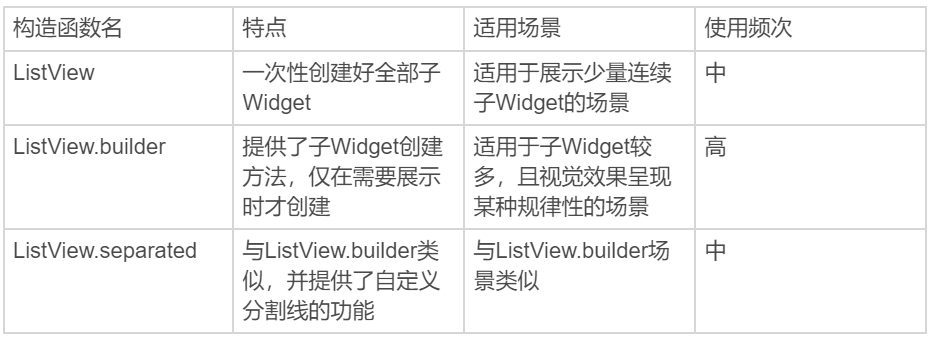
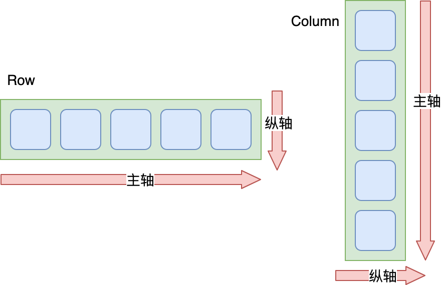

# -

## Text文本展示

通过 TextStyle 控制字符串的展示样式，其他参数控制文本布局，可以实现单一样式的文本展示；而通过 TextSpan 将字符串分割为若干片段，对每个片段单独设置样式后组装，可以实现支持混合样式的富文本展示。

## Image图片

- 支持网络、本地、资源
- 类似Android的ImageView，iOS的UIImageView
- FadeInImage控件提升用户体验
- ImageCache 使用LRU缓存更新策略，默认存1000张，100MB限制。限定的空间已存满数据时，把最久没有被访问到的图片清除。图片缓存只会在运行期间生效，也就是只缓存在内存中。如果想要支持缓存到文件系统，可以使用第三方的CachedNetworkImage控件

## ListView

- 类似Android 中ListView\RecyclerView, iOS中UITableView
- 通过设置它的 children 参数，很方便地将所有的子 Widget 包含到 ListView 中
- 性能不好，要求提前将所有子 Widget 一次性创建好，而不是等到它们真正在屏幕上需要显示时才创建，所以有一个很明显的缺点，就是性能不好。因此，这种方式仅适用于列表中含有少量元素的场景
- ListView.builder，则适用于子 Widget 比较多的场景。这个构造函数有两个关键参数：
  - itemBuilder，是列表项的创建方法。当列表滚动到相应位置时，ListView 会调用该方法创建对应的子 Widget。
  - itemCount，表示列表项的数量，如果为空，则表示 ListView 为无限列表



## CustomScrollView

用来处理多个需要自定义滚动效果的 Widget。在 CustomScrollView 中，这些彼此独立的、可滚动的 Widget 被统称为 **Sliver**。比如，ListView 的 Sliver 实现为 SliverList，AppBar 的 Sliver 实现为 SliverAppBar。这些 Sliver 不再维护各自的滚动状态，而是交由 CustomScrollView 统一管理，最终实现滑动效果的一致性。
- ScrollController 来监听 ListView 滚动信息，以及怎样进行滚动控制
- NotificationListener. NotificationListener 是一个 Widget，为了监听滚动类型的事件，我们需要将 NotificationListener 添加为 被监听容器的父容器，通过 onNotification 回调函数实现监听逻辑

## 布局

### 单子 Widget 布局

Container、Padding 与 Center

单子 Widget 布局类容器比较简单，一般用来对其唯一的子 Widget 进行样式包装，比如限制大小、添加背景色样式、内间距、旋转变换等。这一类布局 Widget，包括 Container、Padding 与 Center 三种。

Container，是一种允许在其内部添加其他控件的控件，也是 UI 框架中的一个常见概念。

在 Flutter 中，Container 本身可以单独作为控件存在（比如单独设置背景色、宽高），也可以作为其他控件的父级存在：Container 可以定义布局过程中子 Widget 如何摆放，以及如何展示。与其他框架不同的是，Flutter 的 Container 仅能包含一个子 Widget

### 多子 Widget 布局

Row、Column 与 Expanded

对于拥有多个子 Widget 的布局类容器而言，其布局行为无非就是两种规则的抽象：水平方向上应该如何布局、垂直方向上应该如何布局。

如同 Android 的 LinearLayout、前端的 Flex 布局一样。

Flutter 中也有类似的概念，即将子 Widget 按行水平排列的 Row，按列垂直排列的 Column，以及负责分配这些子 Widget 在布局方向（行 / 列）中剩余空间的 Expanded。



Row 中：

Row的主轴对齐方式


Row的纵轴对齐方式


设置主轴大小：MainAxisSize

## 层叠 Widget 布局

Stack 与 Positioned

Stack 容器与前端中的绝对定位、Android 中的 Frame 布局非常类似，子 Widget 之间允许叠加，还可以根据父容器上、下、左、右四个角的位置来确定自己的位置。

Stack 提供了层叠布局的容器，而 Positioned 则提供了设置子 Widget 位置的能力。

Stack 控件允许其子 Widget 按照创建的先后顺序进行层叠摆放，而 Positioned 控件则用来控制这些子 Widget 的摆放位置。需要注意的是，Positioned 控件只能在 Stack 中使用，在其他容器中使用会报错。

## 自定义视图

- 组装方式

- 自绘方式定义控件，CustomPaint容器，通过CustomPainter进行绘制逻辑的封装，通过Paint画笔、Canvas画布进行绘制

## App主题

为整个 App 提供统一的视觉呈现效果固然很有必要，但有时我们希望为某个页面、或是某个区块设置不同于 App 风格的展现样式。以主题切换功能为例，我们希望为不同的主题提供不同的展示预览。

在 Flutter 中，我们可以使用 Theme 来对 App 的主题进行局部覆盖。Theme 是一个单子 Widget 容器，与 MaterialApp 类似的，我们可以通过设置其 data 属性，对其子 Widget 进行样式定制：

如果我们不想继承任何 App 全局的颜色或字体样式，可以直接新建一个 ThemeData 实例，依次设置对应的样式；

而如果我们不想在局部重写所有的样式，则可以继承 App 的主题，使用 copyWith 方法，只更新部分样式。

```dart
// 新建主题
Theme(
    data: ThemeData(iconTheme: IconThemeData(color: Colors.red)),
    child: Icon(Icons.favorite)
);

// 继承主题
Theme(
    data: Theme.of(context).copyWith(iconTheme: IconThemeData(color: Colors.green)),
    child: Icon(Icons.feedback)
);
```

Theme.of(context) 方法将向上查找 Widget 树，并返回 Widget 树中最近的主题 Theme。如果 Widget 的父 Widget 们有一个单独的主题定义，则使用该主题。如果不是，那就使用 App 全局主题。

```dart
Container(
    color: Theme.of(context).primaryColor,//容器背景色复用应用主题色
    child: Text(
      'Text with a background color',
      style: Theme.of(context).textTheme.title,//Text组件文本样式复用应用文本样式
    ));
```

分平台主题定制

可以根据 defaultTargetPlatform 来判断当前应用所运行的平台，从而根据系统类型来设置对应的主题。

```dart
// 应用初始化
MaterialApp( title: 'Flutter Demo', theme: defaultTargetPlatform == TargetPlatform.iOS ? kIOSTheme : kAndroidTheme,//根据平台选择不同主题 home: MyHomePage(title: 'Flutter Demo Home Page'),);
```

## 依赖管理

一个应用程序主要由两部分内容组成：代码和资源。代码关注逻辑功能，而如图片、字符串、字体、配置文件等资源则关注视觉功能。

将代码与资源分离，不仅有助于单独维护资源，还可以更精确地对特定设备提供兼容性支持。

在 Flutter 中，资源可以是任意类型的文件，可以被放到任意目录下，但需要通过 pubspec.yaml 文件将它们的路径进行统一地显式声明。

Flutter 对图片提供了基于像素密度的管理方式，我们需要将 1.0x，2.0x 与 3.0x 的资源分开管理，但只需要在 pubspec.yaml 中声明一次。

如果应用中缺少对于高像素密度设备的资源支持，Flutter 会进行自动降级。对于字体这种基于字符图形映射的资源文件，Flutter 提供了精细的管理机制，可以支持除了正常字体外，还支持粗体、斜体等样式。

最后，由于 Flutter 启动时依赖原生系统运行环境，因此我们还需要去原生工程中，设置相应的 App 启动图标和启动图。

## Pub

Dart 提供了包管理工具 Pub，用来管理代码和资源。从本质上说，包（package）实际上就是一个包含了 pubspec.yaml 文件的目录，其内部可以包含代码、资源、脚本、测试和文档等文件。包中包含了需要被外部依赖的功能抽象，也可以依赖其他包。

与 Android 中的 JCenter/Maven、iOS 中的 CocoaPods、前端中的 npm 库类似，Dart 提供了官方的包仓库 Pub。通过 Pub，我们可以很方便地查找到有用的第三方包。

当然，这并不意味着我们可以简单地拿别人的库来拼凑成一个应用程序。**Dart 提供包管理工具 Pub 的真正目的是，让你能够找到真正好用的、经过线上大量验证的库，复用他人的成果来缩短开发周期，提升软件质量**。在 Dart 中，库和应用都属于包。pubspec.yaml 是包的配置文件，包含了包的元数据（比如，包的名称和版本）、运行环境（也就是 Dart SDK 与 Fluter SDK 版本）、外部依赖、内部配置（比如，资源管理）。

对于包，我们通常是指定版本区间，而很少直接指定特定版本，因为包升级变化很频繁，如果有其他的包直接或间接依赖这个包的其他版本时，就会经常发生冲突。

而对于运行环境，**如果是团队多人协作的工程，建议将 Dart 与 Flutter 的 SDK 环境写死**，统一团队的开发环境，避免因为跨 SDK 版本出现的 API 差异进而导致工程问题

1、pubspec.yaml 算是对 flutter 项目配置的管理，类似于 Android 中的 gradle，这些配置包括：项目名称(但是如果桌面的应用名称还得去具体平台的项目里面修改)、项目描述 、各种资源(资源包括图片、文件、字体等)，图片文件等资源需要在 yaml 文件中的 assets 标签下配置，字体需要在 fonts 标签下配置；

当然也有项目依赖 dart sdk 的版本配置，项目所依赖的第三方库的配置，而这些第三方库可以是远程 pub 仓库(类似于 jcenter/maven)，也可以是 git 仓库，还可以是 本地的依赖库。

.packages 文件里面配置了远程依赖库下载到本地的路径，是一种映射关系。

pubspec.lock 文件里面则是配置了远程依赖库的具体信息，包括依赖库名称、版本号以及依赖地址。里面也有 dart sdk 的版本号。

2、.packages 是不需要版本管理，也不需要提交至远程仓库，应当对它添加忽略，因为它是与本地的映射，每个人的本地目录是不同的；pubspec.lock 则是需要版本管理的，因为他里面记录了具体的依赖信息。

3、 ^version表示向后兼容的一个版本范围。比如，^1.2.3相当于'>=1.2.3<2.0.0'，^0.1.2相当于'>=0.1.2<0.2.0'。

代编程语言大都自带第依赖管理机制，其核心功能是为工程中所有直接或间接依赖的代码库找到合适的版本，但这并不容易。就比如前端的依赖管理器 npm 的早期版本，就曾因为不太合理的算法设计，导致计算依赖耗时过长，依赖文件夹也高速膨胀，一度被开发者们戏称为“黑洞”。**而 Dart 使用的 Pub 依赖管理机制所采用的PubGrub 算法则解决了这些问题，因此被称为下一代版本依赖解决算法**，在 2018 年底被苹果公司吸纳，成为 Swift 所采用的依赖管理器算法。

## 交互事件响应

### 指针事件

指针事件表示用户交互的原始触摸数据，如手指接触屏幕 PointerDownEvent、手指在屏幕上移动 PointerMoveEvent、手指抬起 PointerUpEvent，以及触摸取消 PointerCancelEvent，这与原生系统的底层触摸事件抽象是一致的。在手指接触屏幕，触摸事件发起时，Flutter 会确定手指与屏幕发生接触的位置上究竟有哪些组件，并将触摸事件交给最内层的组件去响应。与浏览器中的事件冒泡机制类似，事件会从这个最内层的组件开始，沿着组件树向根节点向上冒泡分发。不过 Flutter 无法像浏览器冒泡那样取消或者停止事件进一步分发，我们只能通过 hitTestBehavior 去调整组件在命中测试期内应该如何表现，比如把触摸事件交给子组件，或者交给其视图层级之下的组件去响应。关于组件层面的原始指针事件的监听，Flutter 提供了 Listener Widget，可以监听其子 Widget 的原始指针事件。

### 手势识别

Gesture 是手势语义的抽象，而如果我们想从组件层监听手势，则需要使用 GestureDetector。GestureDetector 是一个处理各种高级用户触摸行为的 Widget，与 Listener 一样，也是一个功能性组件。Gesture 可以支持同时分发多个手势交互行为，意味着我们可以通过 Gesture 同时监听多个事件。

对一个 Widget 同时监听了多个手势事件，但最终只会有一个手势能够得到本次事件的处理权。对于多个手势的识别，Flutter 引入了手势竞技场（Arena）的概念，用来识别究竟哪个手势可以响应用户事件。手势竞技场会考虑用户触摸屏幕的时长、位移以及拖动方向，来确定最终手势。

手势识别发生在多个存在父子关系的视图时，手势竞技场会一并检查父视图和子视图的手势，并且通常最终会确认由子视图来响应事件。而这也是合乎常理的：从视觉效果上看，子视图的视图层级位于父视图之上，相当于对其进行了遮挡，因此从事件处理上看，子视图自然是事件响应的第一责任人