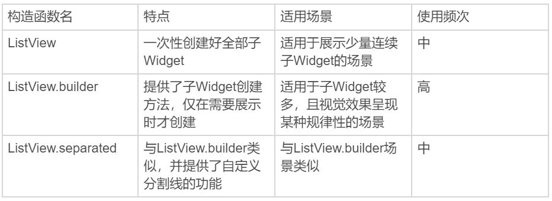
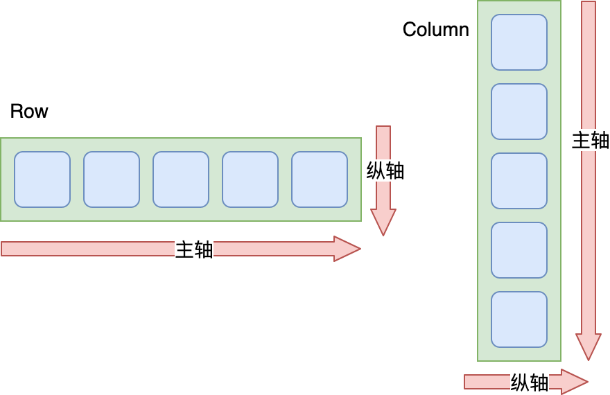
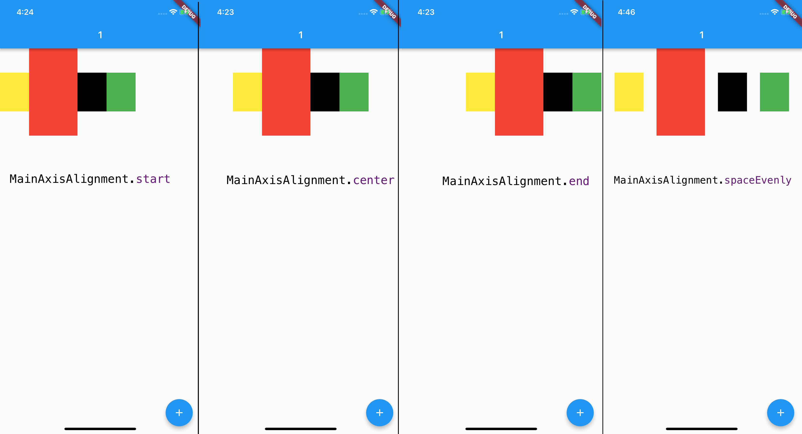
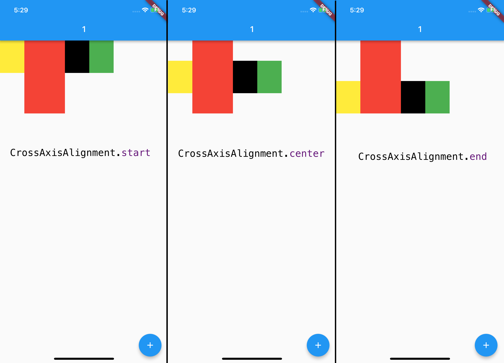
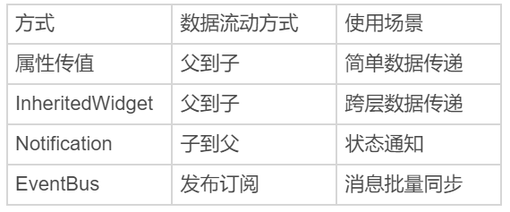

# -

## Text文本展示

通过 TextStyle 控制字符串的展示样式，其他参数控制文本布局，可以实现单一样式的文本展示；而通过 TextSpan 将字符串分割为若干片段，对每个片段单独设置样式后组装，可以实现支持混合样式的富文本展示。

## Image图片

- 支持网络、本地、资源
- 类似Android的ImageView，iOS的UIImageView
- FadeInImage控件提升用户体验
- ImageCache 使用LRU缓存更新策略，默认存1000张，100MB限制。限定的空间已存满数据时，把最久没有被访问到的图片清除。图片缓存只会在运行期间生效，也就是只缓存在内存中。如果想要支持缓存到文件系统，可以使用第三方的CachedNetworkImage控件

## ListView

- 类似Android 中ListView\RecyclerView, iOS中UITableView
- 通过设置它的 children 参数，很方便地将所有的子 Widget 包含到 ListView 中
- 性能不好，要求提前将所有子 Widget 一次性创建好，而不是等到它们真正在屏幕上需要显示时才创建，所以有一个很明显的缺点，就是性能不好。因此，这种方式仅适用于列表中含有少量元素的场景
- ListView.builder，则适用于子 Widget 比较多的场景。这个构造函数有两个关键参数：
  - itemBuilder，是列表项的创建方法。当列表滚动到相应位置时，ListView 会调用该方法创建对应的子 Widget。
  - itemCount，表示列表项的数量，如果为空，则表示 ListView 为无限列表



## CustomScrollView

用来处理多个需要自定义滚动效果的 Widget。在 CustomScrollView 中，这些彼此独立的、可滚动的 Widget 被统称为 **Sliver**。比如，ListView 的 Sliver 实现为 SliverList，AppBar 的 Sliver 实现为 SliverAppBar。这些 Sliver 不再维护各自的滚动状态，而是交由 CustomScrollView 统一管理，最终实现滑动效果的一致性。
- ScrollController 来监听 ListView 滚动信息，以及怎样进行滚动控制
- NotificationListener. NotificationListener 是一个 Widget，为了监听滚动类型的事件，我们需要将 NotificationListener 添加为 被监听容器的父容器，通过 onNotification 回调函数实现监听逻辑

## 布局

### 单子 Widget 布局

Container、Padding 与 Center

单子 Widget 布局类容器比较简单，一般用来对其唯一的子 Widget 进行样式包装，比如限制大小、添加背景色样式、内间距、旋转变换等。这一类布局 Widget，包括 Container、Padding 与 Center 三种。

Container，是一种允许在其内部添加其他控件的控件，也是 UI 框架中的一个常见概念。

在 Flutter 中，Container 本身可以单独作为控件存在（比如单独设置背景色、宽高），也可以作为其他控件的父级存在：Container 可以定义布局过程中子 Widget 如何摆放，以及如何展示。与其他框架不同的是，Flutter 的 Container 仅能包含一个子 Widget

### 多子 Widget 布局

Row、Column 与 Expanded

对于拥有多个子 Widget 的布局类容器而言，其布局行为无非就是两种规则的抽象：水平方向上应该如何布局、垂直方向上应该如何布局。

如同 Android 的 LinearLayout、前端的 Flex 布局一样。

Flutter 中也有类似的概念，即将子 Widget 按行水平排列的 Row，按列垂直排列的 Column，以及负责分配这些子 Widget 在布局方向（行 / 列）中剩余空间的 Expanded。



Row 中：

Row的主轴对齐方式



Row的纵轴对齐方式



设置主轴大小：MainAxisSize

## 层叠 Widget 布局

Stack 与 Positioned

Stack 容器与前端中的绝对定位、Android 中的 Frame 布局非常类似，子 Widget 之间允许叠加，还可以根据父容器上、下、左、右四个角的位置来确定自己的位置。

Stack 提供了层叠布局的容器，而 Positioned 则提供了设置子 Widget 位置的能力。

Stack 控件允许其子 Widget 按照创建的先后顺序进行层叠摆放，而 Positioned 控件则用来控制这些子 Widget 的摆放位置。需要注意的是，Positioned 控件只能在 Stack 中使用，在其他容器中使用会报错。

## 自定义视图

- 组装方式

- 自绘方式定义控件，CustomPaint容器，通过CustomPainter进行绘制逻辑的封装，通过Paint画笔、Canvas画布进行绘制

## App主题

为整个 App 提供统一的视觉呈现效果固然很有必要，但有时我们希望为某个页面、或是某个区块设置不同于 App 风格的展现样式。以主题切换功能为例，我们希望为不同的主题提供不同的展示预览。

在 Flutter 中，我们可以使用 Theme 来对 App 的主题进行局部覆盖。Theme 是一个单子 Widget 容器，与 MaterialApp 类似的，我们可以通过设置其 data 属性，对其子 Widget 进行样式定制：

如果我们不想继承任何 App 全局的颜色或字体样式，可以直接新建一个 ThemeData 实例，依次设置对应的样式；

而如果我们不想在局部重写所有的样式，则可以继承 App 的主题，使用 copyWith 方法，只更新部分样式。

```dart
// 新建主题
Theme(
    data: ThemeData(iconTheme: IconThemeData(color: Colors.red)),
    child: Icon(Icons.favorite)
);

// 继承主题
Theme(
    data: Theme.of(context).copyWith(iconTheme: IconThemeData(color: Colors.green)),
    child: Icon(Icons.feedback)
);
```

Theme.of(context) 方法将向上查找 Widget 树，并返回 Widget 树中最近的主题 Theme。如果 Widget 的父 Widget 们有一个单独的主题定义，则使用该主题。如果不是，那就使用 App 全局主题。

```dart
Container(
    color: Theme.of(context).primaryColor,//容器背景色复用应用主题色
    child: Text(
      'Text with a background color',
      style: Theme.of(context).textTheme.title,//Text组件文本样式复用应用文本样式
    ));
```

分平台主题定制

可以根据 defaultTargetPlatform 来判断当前应用所运行的平台，从而根据系统类型来设置对应的主题。

```dart
// 应用初始化
MaterialApp( title: 'Flutter Demo', theme: defaultTargetPlatform == TargetPlatform.iOS ? kIOSTheme : kAndroidTheme,//根据平台选择不同主题 home: MyHomePage(title: 'Flutter Demo Home Page'),);
```

## 依赖管理

一个应用程序主要由两部分内容组成：代码和资源。代码关注逻辑功能，而如图片、字符串、字体、配置文件等资源则关注视觉功能。

将代码与资源分离，不仅有助于单独维护资源，还可以更精确地对特定设备提供兼容性支持。

在 Flutter 中，资源可以是任意类型的文件，可以被放到任意目录下，但需要通过 pubspec.yaml 文件将它们的路径进行统一地显式声明。

Flutter 对图片提供了基于像素密度的管理方式，我们需要将 1.0x，2.0x 与 3.0x 的资源分开管理，但只需要在 pubspec.yaml 中声明一次。

如果应用中缺少对于高像素密度设备的资源支持，Flutter 会进行自动降级。对于字体这种基于字符图形映射的资源文件，Flutter 提供了精细的管理机制，可以支持除了正常字体外，还支持粗体、斜体等样式。

最后，由于 Flutter 启动时依赖原生系统运行环境，因此我们还需要去原生工程中，设置相应的 App 启动图标和启动图。

## Pub

Dart 提供了包管理工具 Pub，用来管理代码和资源。从本质上说，包（package）实际上就是一个包含了 pubspec.yaml 文件的目录，其内部可以包含代码、资源、脚本、测试和文档等文件。包中包含了需要被外部依赖的功能抽象，也可以依赖其他包。

与 Android 中的 JCenter/Maven、iOS 中的 CocoaPods、前端中的 npm 库类似，Dart 提供了官方的包仓库 Pub。通过 Pub，我们可以很方便地查找到有用的第三方包。

当然，这并不意味着我们可以简单地拿别人的库来拼凑成一个应用程序。**Dart 提供包管理工具 Pub 的真正目的是，让你能够找到真正好用的、经过线上大量验证的库，复用他人的成果来缩短开发周期，提升软件质量**。在 Dart 中，库和应用都属于包。pubspec.yaml 是包的配置文件，包含了包的元数据（比如，包的名称和版本）、运行环境（也就是 Dart SDK 与 Fluter SDK 版本）、外部依赖、内部配置（比如，资源管理）。

对于包，我们通常是指定版本区间，而很少直接指定特定版本，因为包升级变化很频繁，如果有其他的包直接或间接依赖这个包的其他版本时，就会经常发生冲突。

而对于运行环境，**如果是团队多人协作的工程，建议将 Dart 与 Flutter 的 SDK 环境写死**，统一团队的开发环境，避免因为跨 SDK 版本出现的 API 差异进而导致工程问题

1、pubspec.yaml 算是对 flutter 项目配置的管理，类似于 Android 中的 gradle，这些配置包括：项目名称(但是如果桌面的应用名称还得去具体平台的项目里面修改)、项目描述 、各种资源(资源包括图片、文件、字体等)，图片文件等资源需要在 yaml 文件中的 assets 标签下配置，字体需要在 fonts 标签下配置；

当然也有项目依赖 dart sdk 的版本配置，项目所依赖的第三方库的配置，而这些第三方库可以是远程 pub 仓库(类似于 jcenter/maven)，也可以是 git 仓库，还可以是 本地的依赖库。

.packages 文件里面配置了远程依赖库下载到本地的路径，是一种映射关系。

pubspec.lock 文件里面则是配置了远程依赖库的具体信息，包括依赖库名称、版本号以及依赖地址。里面也有 dart sdk 的版本号。

2、.packages 是不需要版本管理，也不需要提交至远程仓库，应当对它添加忽略，因为它是与本地的映射，每个人的本地目录是不同的；pubspec.lock 则是需要版本管理的，因为他里面记录了具体的依赖信息。

3、 ^version表示向后兼容的一个版本范围。比如，^1.2.3相当于'>=1.2.3<2.0.0'，^0.1.2相当于'>=0.1.2<0.2.0'。

代编程语言大都自带第依赖管理机制，其核心功能是为工程中所有直接或间接依赖的代码库找到合适的版本，但这并不容易。就比如前端的依赖管理器 npm 的早期版本，就曾因为不太合理的算法设计，导致计算依赖耗时过长，依赖文件夹也高速膨胀，一度被开发者们戏称为“黑洞”。**而 Dart 使用的 Pub 依赖管理机制所采用的PubGrub 算法则解决了这些问题，因此被称为下一代版本依赖解决算法**，在 2018 年底被苹果公司吸纳，成为 Swift 所采用的依赖管理器算法。

## 交互事件响应

### 指针事件

指针事件表示用户交互的原始触摸数据，如手指接触屏幕 PointerDownEvent、手指在屏幕上移动 PointerMoveEvent、手指抬起 PointerUpEvent，以及触摸取消 PointerCancelEvent，这与原生系统的底层触摸事件抽象是一致的。在手指接触屏幕，触摸事件发起时，Flutter 会确定手指与屏幕发生接触的位置上究竟有哪些组件，并将触摸事件交给最内层的组件去响应。与浏览器中的事件冒泡机制类似，事件会从这个最内层的组件开始，沿着组件树向根节点向上冒泡分发。不过 Flutter 无法像浏览器冒泡那样取消或者停止事件进一步分发，我们只能通过 hitTestBehavior 去调整组件在命中测试期内应该如何表现，比如把触摸事件交给子组件，或者交给其视图层级之下的组件去响应。关于组件层面的原始指针事件的监听，Flutter 提供了 Listener Widget，可以监听其子 Widget 的原始指针事件。

### 手势识别

Gesture 是手势语义的抽象，而如果我们想从组件层监听手势，则需要使用 GestureDetector。GestureDetector 是一个处理各种高级用户触摸行为的 Widget，与 Listener 一样，也是一个功能性组件。Gesture 可以支持同时分发多个手势交互行为，意味着我们可以通过 Gesture 同时监听多个事件。

对一个 Widget 同时监听了多个手势事件，但最终只会有一个手势能够得到本次事件的处理权。对于多个手势的识别，Flutter 引入了手势竞技场（Arena）的概念，用来识别究竟哪个手势可以响应用户事件。手势竞技场会考虑用户触摸屏幕的时长、位移以及拖动方向，来确定最终手势。

手势识别发生在多个存在父子关系的视图时，手势竞技场会一并检查父视图和子视图的手势，并且通常最终会确认由子视图来响应事件。而这也是合乎常理的：从视觉效果上看，子视图的视图层级位于父视图之上，相当于对其进行了遮挡，因此从事件处理上看，子视图自然是事件响应的第一责任人

## 跨组件传递数据

### InheritedWidget

InheritedWidget 是 Flutter 中的一个功能型 Widget，适用于在 Widget 树中共享数据的场景。通过它，我们可以高效地将数据在 Widget 树中进行跨层传递。从父 Widget 到子 Widget 逐层传递。

### Notification

数据流动方式是从子 Widget 向上传递至父 Widget。这样的数据传递机制适用于子 Widget 状态变更，发送通知上报的场景。

自定义通知的监听与 ScrollNotification 并无不同，而如果想要实现自定义通知，我们首先需要继承 Notification 类。Notification 类提供了 dispatch 方法，可以让我们沿着 context 对应的 Element 节点树向上逐层发送通知。

子Widget
```dart


class CustomNotification extends Notification {
  CustomNotification(this.msg);
  final String msg;
}

//抽离出一个子Widget用来发通知
class CustomChild extends StatelessWidget {
  @override
  Widget build(BuildContext context) {
    return RaisedButton(
      //按钮点击时分发通知
      onPressed: () => CustomNotification("Hi").dispatch(context),
      child: Text("Fire Notification"),
    );
  }
}
```

父Widget

```dart

class _MyHomePageState extends State<MyHomePage> {
  String _msg = "通知：";
  @override
  Widget build(BuildContext context) {
    //监听通知
    return NotificationListener<CustomNotification>(
        onNotification: (notification) {
          setState(() {_msg += notification.msg+"  ";});//收到子Widget通知，更新msg
        },
        child:Column(
          mainAxisAlignment: MainAxisAlignment.center,
          children: <Widget>[Text(_msg),CustomChild()],//将子Widget加入到视图树中
        )
    );
  }
}
```

### EventBus

无论是 InheritedWidget 还是 Notificaiton，它们的使用场景都需要依靠 Widget 树，也就意味着只能在有父子关系的 Widget 之间进行数据共享。但是，组件间数据传递还有一种常见场景：这些组件间不存在父子关系。

事件总线是在 Flutter 中实现跨组件通信的机制。EventBus 是一个第三方插件,它遵循发布 / 订阅模式，允许订阅者订阅事件，当发布者触发事件时，订阅者和发布者之间可以通过事件进行交互。发布者和订阅者之间无需有父子关系，甚至非 Widget 对象也可以发布 / 订阅。这些特点与其他平台的事件总线机制是类似的。



## 路由导航

在 Flutter 中，页面之间的跳转是通过 Route 和 Navigator 来管理的：

Route 是页面的抽象，主要负责创建对应的界面，接收参数，响应 Navigator 打开和关闭；

而 Navigator 则会维护一个路由栈管理 Route，Route 打开即入栈，Route 关闭即出栈，还可以直接替换栈内的某一个 Route。

而根据是否需要提前注册页面标识符，Flutter 中的路由管理可以分为两种方式：

基本路由。无需提前注册，在页面切换时需要自己构造页面实例。

命名路由。需要提前注册页面标识符，在页面切换时通过标识符直接打开新的路由。

### 基本路由

基本路由的使用方法和 Android/iOS 打开新页面的方式非常相似。要导航到一个新的页面，我们需要创建一个 MaterialPageRoute 的实例，调用 Navigator.push 方法将新页面压到堆栈的顶部。

其中，MaterialPageRoute 是一种路由模板，定义了路由创建及切换过渡动画的相关配置，可以针对不同平台，实现与平台页面切换动画风格一致的路由切换动画。

而如果我们想返回上一个页面，则需要调用 Navigator.pop 方法从堆栈中删除这个页面。

### 命名路由

我们给页面起一个名字，然后就可以直接通过页面名字打开它了。这种方式简单直观，与 React 中的 navigation 使用方式类似。

要想通过名字来指定页面切换，我们必须先给应用程序 MaterialApp 提供一个页面名称映射规则，即路由表 routes，这样 Flutter 才知道名字与页面 Widget 的对应关系。

路由表实际上是一个 Map，其中 key 值对应页面名字，而 value 值则是一个 WidgetBuilder 回调函数，我们需要在这个函数中创建对应的页面。而一旦在路由表中定义好了页面名字，我们就可以使用 Navigator.pushNamed 来打开页面了。

在注册路由表时，Flutter 提供了 UnknownRoute 属性，我们可以对未知的路由标识符进行统一的页面跳转处理。

与基本路由能够精确地控制目标页面初始化方式不同，命名路由只能通过字符串名字来初始化固定目标页面。为了解决不同场景下目标页面的初始化需求，Flutter 提供了路由参数的机制，可以在打开路由时传递相关参数，在目标页面通过 RouteSettings 来获取页面参数

与 Android 提供的 startActivityForResult 方法可以监听目标页面的处理结果类似，Flutter 也提供了返回参数的机制。在 push 目标页面时，可以设置目标页面关闭时监听函数，以获取返回参数；而目标页面可以在关闭路由时传递相关参数。

## 动画

### AnimatedBuilder

### AnimateWidget

### hero动画

跨页面共享的控件动画效果有一个专门的名词，即“**共享元素变换**”（Shared Element Transition）。对于 Android 开发者来说，这个概念并不陌生。Android 原生提供了对这种动画效果的支持，通过几行代码，就可以实现在两个 Activity 共享的组件之间做出流畅的转场动画。又比如，Keynote 提供了的“神奇移动”（Magic Move）功能，可以实现两个 Keynote 页面之间的流畅过渡。Flutter 也有类似的概念，即 Hero 控件。通过 Hero，我们可以在两个页面的共享元素之间，做出流畅的页面切换效果。

## EventLoop 模型

Dart 是单线程的，但通过事件循环可以实现异步。而 Future 是异步任务的封装，借助于 await 与 async，我们可以通过事件循环实现非阻塞的同步等待；Isolate 是 Dart 中的多线程，可以实现并发，有自己的事件循环与 Queue，独占资源。Isolate 之间可以通过消息机制进行单向通信，这些传递的消息通过对方的事件循环驱动对方进行异步处理。

在 UI 编程过程中，异步和多线程是两个相伴相生的名词，也是很容易混淆的概念。对于异步方法调用而言，代码不需要等待结果的返回，而是通过其他手段（比如通知、回调、事件循环或多线程）在后续的某个时刻主动（或被动）地接收执行结果。

因此，从辩证关系上来看，异步与多线程并不是一个同等关系：异步是目的，多线程只是我们实现异步的一个手段之一。而在 Flutter 中，借助于 UI 框架提供的事件循环，我们可以不用阻塞的同时等待多个异步任务，因此并不需要开多线程。我们一定要记住这一点。

```
老师，能否这样理解，js是单线程，然后一个事件循环的模型，和flutter一样，I/O是异步的，所以文件，网络都没问题，但是，如果一个While(true)的死循环，js就卡死了，因为只有一个线程。而这种情况flutter没问题，While(true)的死循环可以放到另外一个isolate里面，内存和主isolate也是隔离的，不影响主isolate和主线程。

作者回复: js也可以开web worker，其实是一样的

开启一个Isolate会不会很消耗资源？

作者回复: Isolate会开辟新的内存栈，对内存有更多要求（大约20MB）
```

```
您好老师，单线程模型是指的事件队列模型，和绘制界面的线程是一个吗

作者回复: 我们所说的单线程指的是主Isolate。而GPU绘制指令有单独的线程执行，跟主Isolate无关。事实上Flutter提供了4种task runner，有独立的线程去运行专属的任务：
1.Platform Task Runner：处理来自平台（Android/iOS）的消息
2.UI Task Runner：执行渲染逻辑、处理native plugin的消息、timer、microtask、异步I/O操作处理等
3.GPU Task Runner：执行GPU指令
4.IO Task Runner：执行I/O任务
除此之外，操作系统本身也提供了大量异步并发机制，可以利用多线程去执行任务（比如socket），我们在主Isolate中无需关心（如果真想主动创建并发任务也可以）
```

## 网络请求

在 Flutter 中，Http 网络编程的实现方式主要分为三种：dart:io 里的 HttpClient 实现、Dart 原生 http 请求库实现、第三方库 dio 实现。

http 是 Dart 官方提供的另一个网络请求类，相比于 HttpClient，易用性提升了不少。

```
dependencies:
  http: '>=0.11.3+12'
```

对于常见的上传及下载文件需求，dio 也提供了良好的支持：文件上传可以通过构建表单 FormData 实现，而文件下载则可以使用 download 方法搞定。

```dart
//使用FormData表单构建待上传文件
FormData formData = FormData.from({
  "file1": UploadFileInfo(File("./file1.txt"), "file1.txt"),
  "file2": UploadFileInfo(File("./file2.txt"), "file1.txt"),

});
//通过post方法发送至服务端
var responseY = await dio.post("https://xxx.com/upload", data: formData);
print(responseY.toString());

//使用download方法下载文件
dio.download("https://xxx.com/file1", "xx1.zip");

//增加下载进度回调函数
dio.download("https://xxx.com/file1", "xx2.zip", onReceiveProgress: (count, total) {
  //do something
});
```

```dart
//增加拦截器
dio.interceptors.add(InterceptorsWrapper(
    onRequest: (RequestOptions options){
      //为每个请求头都增加user-agent
      options.headers["user-agent"] = "Custom-UA";
      //检查是否有token，没有则直接报错
      if(options.headers['token'] == null) {
        return dio.reject("Error:请先登录");
      } 
      //检查缓存是否有数据
      if(options.uri == Uri.parse('http://xxx.com/file1')) {
        return dio.resolve("返回缓存数据");
      }
      //放行请求
      return options;
    }
));

//增加try catch，防止请求报错
try {
  var response = await dio.get("https://xxx.com/xxx.zip");
  print(response.data.toString());
}catch(e) {
  print(e);
}
```

```
dependencies:
  dio: '>2.1.3'
```

## JSON 解析

JSON 解析在 Flutter 中相对比较简单，但由于不支持反射，所以我们只能手动解析，即：先将 JSON 字符串转换成 Map，然后再把这个 Map 给到自定义类，进行相关属性的赋值。

如果你有原生 Android、iOS 开发经验的话，可能会觉得 Flutter 提供的 JSON 手动解析方案并不好用。在 Flutter 中，没有像原生开发那样提供了 Gson 或 Mantle 等库，用于将 JSON 字符串直接转换为对应的实体类。而这些能力无一例外都需要用到运行时反射，这是 Flutter 从设计之初就不支持的，理由如下：

运行时反射破坏了类的封装性和安全性，会带来安全风险。就在前段时间，Fastjson 框架就爆出了一个巨大的安全漏洞。这个漏洞使得精心构造的字符串文本，可以在反序列化时让服务器执行任意代码，直接导致业务机器被远程控制、内网渗透、窃取敏感信息等操作。

运行时反射会增加二进制文件大小。因为搞不清楚哪些代码可能会在运行时用到，因此使用反射后，会默认使用所有代码构建应用程序，这就导致编译器无法优化编译期间未使用的代码，应用安装包体积无法进一步压缩，这对于自带 Dart 虚拟机的 Flutter 应用程序是难以接受的。

反射给开发者编程带来了方便，但也带来了很多难以解决的新问题，因此 Flutter 并不支持反射。而我们要做的就是，老老实实地手动解析 JSON 吧。

## 数据持久化

由于 Flutter 仅接管了渲染层，真正涉及到存储等操作系统底层行为时，还需要依托于原生 Android、iOS，因此与原生开发类似的，根据需要持久化数据的大小和方式不同，Flutter 提供了三种数据持久化方法，即文件、SharedPreferences 与数据库。

### 文件

文件是存储在某种介质（比如磁盘）上指定路径的、具有文件名的一组有序信息的集合。从其定义看，要想以文件的方式实现数据持久化，我们首先需要确定一件事儿：数据放在哪儿？这，就意味着要定义文件的存储路径。

Flutter 提供了两种文件存储的目录，即临时（Temporary）目录与文档（Documents）目录：

- 临时目录是操作系统可以随时清除的目录，通常被用来存放一些不重要的临时缓存数据。这个目录在 iOS 上对应着 NSTemporaryDirectory 返回的值，而在 Android 上则对应着 getCacheDir 返回的值。

- 文档目录则是只有在删除应用程序时才会被清除的目录，通常被用来存放应用产生的重要数据文件。在 iOS 上，这个目录对应着 NSDocumentDirectory，而在 Android 上则对应着 AppData 目录。

**文件**适用于字符串或者二进制流的数据持久化，我们可以根据访问频次，决定将它存在临时目录或是文档目录。而 **SharedPreferences** 则适用于存储小型键值对信息，可以应对一些轻量配置缓存的场景。**数据库**则适用于频繁变化的、结构化的对象存取，可以轻松应对数据的增删改查。

### SharedPreferences

文件比较适合大量的、有序的数据持久化，如果我们只是需要缓存少量的键值对信息（比如记录用户是否阅读了公告，或是简单的计数），不过需要注意的是，以键值对的方式只能存储基本类型的数据，比如 int、double、bool 和 string,则可以使用 SharedPreferences。

SharedPreferences 会以原生平台相关的机制，为简单的键值对数据提供持久化存储，即在 iOS 上使用 NSUserDefaults，在 Android 使用 SharedPreferences。

### 数据库

SharedPrefernces 的使用固然方便，但这种方式只适用于持久化少量数据的场景，我们并不能用它来存储大量数据，比如文件内容（文件路径是可以的）。

如果我们需要持久化大量格式化后的数据，并且这些数据还会以较高的频率更新，为了考虑进一步的扩展性，我们通常会选用 sqlite 数据库来应对这样的场景。与文件和 SharedPreferences 相比，数据库在数据读写上可以提供更快、更灵活的解决方案。

## 方法通道

方法通道解决了逻辑层的原生能力复用问题，使得 Flutter 能够通过轻量级的异步方法调用，实现与原生代码的交互。一次典型的调用过程由 Flutter 发起方法调用请求开始，请求经由唯一标识符指定的方法通道到达原生代码宿主，而原生代码宿主则通过注册对应方法实现、响应并处理调用请求，最后将执行结果通过消息通道，回传至 Flutter。​

需要注意的是，方法通道是非线程安全的。这意味着原生代码与 Flutter 之间所有接口调用必须发生在主线程。Flutter 是单线程模型，因此自然可以确保方法调用请求是发生在主线程（Isolate）的；而原生代码在处理方法调用请求时，如果涉及到异步或非主线程切换，需要确保回调过程是在原生系统的 UI 线程（也就是 Android 和 iOS 的主线程）中执行的，否则应用可能会出现奇怪的 Bug，甚至是 Crash。

## 平台视图

Flutter 提供了平台视图工厂和视图标识符两个概念，因此 Dart 层发起的视图创建请求可以通过标识符直接找到对应的视图创建工厂，从而实现原生视图与 Flutter 视图的融合复用。对于需要在运行期动态调用原生视图接口的需求，我们可以在原生视图的封装类中注册方法通道，实现精确控制原生视图展示的效果。

需要注意的是，由于 Flutter 与原生渲染方式完全不同，因此转换不同的渲染数据会有较大的性能开销。如果在一个界面上同时实例化多个原生控件，就会对性能造成非常大的影响，所以我们要避免在使用 Flutter 控件也能实现的情况下去使用内嵌平台视图。

因为这样做，一方面需要分别在 Android 和 iOS 端写大量的适配桥接代码，违背了跨平台技术的本意，也增加了后续的维护成本；另一方面毕竟除去地图、WebView、相机等涉及底层方案的特殊情况外，大部分原生代码能够实现的 UI 效果，完全可以用 Flutter 实现。

## 状态管理

Flutter 在设计声明式 UI 上借鉴了不少 React 的设计思想，因此涌现了诸如 flutter_redux、flutter_mobx 、fish_redux 等基于前端设计理念的状态管理框架。但这些框架大都比较复杂，且需要对框架设计概念有一定理解，学习门槛相对较高。

而源自 Flutter 官方的状态管理框架 Provider 则相对简单得多，不仅容易理解，而且框架的入侵性小，还可以方便地组合和控制 UI 刷新粒度。因此，在 Google I/O 2019 大会一经面世，Provider 就成为了官方推荐的状态管理方式之一。

Provider 是一个用来提供数据的框架。它是 InheritedWidget 的语法糖，提供了依赖注入的功能，允许在 Widget 树中更加灵活地处理和传递数据

## 编译模式

- Debug

- Release

- Profile

### 分离配置环境

通过断言和 kReleaseMode 常量，我们能够识别出当前 App 的编译环境，从而可以在运行时对某个代码功能进行局部微调。而如果我们想在整个应用层面，为不同的运行环境提供更为统一的配置（比如，对于同一个接口调用行为，开发环境会使用 dev.example.com 域名，而生产环境会使用 api.example.com 域名），则需要在应用启动入口提供可配置的初始化方式，根据特定需求为应用注入配置环境。在 Flutter 构建 App 时，为应用程序提供不同的配置环境，总体可以分为抽象配置、配置多入口、读配置和编译打包 4 个步骤：

抽象出应用程序的可配置部分，并使用 InheritedWidget 对其进行封装；

将不同的配置环境拆解为多个应用程序入口（比如，开发环境为 main-dev.dart、生产环境为 main.dart），把应用程序的可配置部分固化在各个入口处；

在运行期，通过 InheritedWidget 提供的数据共享机制，将配置部分应用到其子 Widget 对应的功能中；

使用 Flutter 提供的编译打包选项，构建出不同配置环境的安装包。

## Hot Reload

不支持

- 代码出现编译错误；
- Widget 状态无法兼容；
- 全局变量和静态属性的更改；
- main 方法里的更改；
- initState 方法里的更改；
- 枚举和泛类型更改。

## 异常处理信息捕获

## 持续交付

Travis /Jenkins CI

俗话说，“90% 的故障都是由变更引起的”，这凸显了持续交付对于发布稳定性保障的价值。通过建立持续交付流程链机制，我们可以将代码变更与自动化手段关联起来，让测试和发布变得更快、更频繁，不仅可以提早暴露风险，还能让软件可以持续稳定地保持在随时可发布的状态。在今天的分享中，我与你介绍了如何通过 Travis CI，为我们的项目引入持续交付能力。Travis 的自动化任务的工作流依靠.travis.yml 配置文件驱动，我们可以在确认好构建任务需要的命令集合后，在这个配置文件中依照 install、script 和 deploy 这 3 个步骤拆解执行过程。完成项目的配置之后，一旦 Travis 检测到代码变更，就可以自动执行任务了。简单清晰的发布流程是软件可靠性的前提。如果我们同时发布了 100 个代码变更，导致 App 性能恶化了，我们可能需要花费大量时间和精力，去定位究竟是哪些变更影响了 App 性能，以及它们是如何影响的。而如果以持续交付的方式发布 App，我们能够以更小的粒度去测量和理解代码变更带来的影响，是改善还是退化，从而可以更早地找到问题，更有信心进行更快的发布。