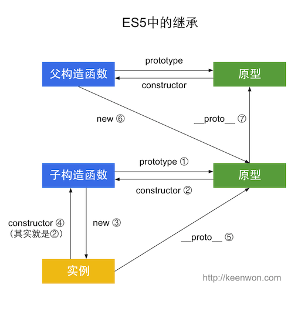

# ES5

>ES5中的继承，看图：



```js
function Super() {}
 
function Sub() {}
Sub.prototype = new Super();
Sub.prototype.constructor = Sub;
 
var sub = new Sub();
 
Sub.prototype.constructor === Sub; // ② true
sub.constructor === Sub; // ④ true
sub.__proto__ === Sub.prototype; // ⑤ true
Sub.prototype.__proto__ == Super.prototype; // ⑦ true
```

**`ES5`中这种最简单的继承，实质上就是将子类的原型设置为父类的实例。**

# ES6

>ES6中的继承，看图：


```js
class Super {}
 
class Sub extends Super {}
 
var sub = new Sub();
 
Sub.prototype.constructor === Sub; // ② true
sub.constructor === Sub; // ④ true
sub.__proto__ === Sub.prototype; // ⑤ true
Sub.__proto__ === Super; // ⑥ true
Sub.prototype.__proto__ === Super.prototype; // ⑦ true
```

所以

**`ES6`和`ES5`的继承是一模一样的，只是多了`class` 和`extends` ，`ES6`的子类和父类，子类原型和父类原型，通过`__proto__` 连接**。

