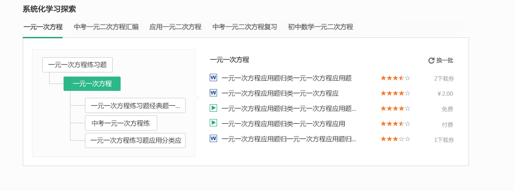

# 利用cache和debounce技术优化tab页签mouseenter切换时的卡顿现象

> 左鹏飞 2017.08.13

## 背景

最近有个tab页签鼠标划入（而不是点击）切换内容的需求。

如下图：



因为每个页签都是调用了后端接口，发现有卡顿的现象。


## cache

首先想到了能不能把数据缓存？当然可以，按照id+pn即id和页码来缓存数据，第二次直接去缓存取

```
var cache = {};

var getDoclistByPn = function (Mediator, options) {

    /**
     * 接口查询
     * @param  {string} type     接口类型
     * @param  {Object} entUuid  知识点id
     * @return {Object}          promise对象
     */
    var flow = function (type, entUuid, pn) {
        var dfd = new $.Deferred();
        var params = {
            url: config.url[type],
            entUuid: entUuid,
            pn: pn
        };
        if (cache[entUuid + '-' + pn]) {
            dfd.resolve(cache[entUuid + '-' + pn]);
        }
        else {
            getContent(params)
            .done(function (data) {
                cache[entUuid + '-' + pn] = data
                dfd.resolve(data);
            });
        }
        return dfd.promise();
    };

    Mediator.on('s:getDoclistByPn', function (opt) {
        var type = opt.type;
        var entUuid = opt.entUuid;
        var pn = opt.pn;
        var promise = opt.promise;
        flow(type, entUuid, pn)
            .then(function (data) {
                promise.resolve(data);
            });
        return promise;
    });
};
```
这样做了后 第二次切换是不卡顿了，但是第一次还是卡顿。咋办呢？防抖来帮忙。


## 防抖

### 1. 背景

在前端开发中会遇到一些频繁的事件触发，比如：

window 的 resize、scroll
mousedown、mousemove
keyup、keydown
……


### 2. 频繁事件触发的后果

如果mousemove后的回调中调用了ajax请求？假设 1 秒触发了 60 次，每个回调就必须在 1000 / 60 = 16.67ms 内完成，否则就会有卡顿出现。


### 3. 什么是防抖？

减少执行频率, 在指定的时间内, 多次调用，只会执行一次。


### 4. 防抖的原理

防抖的原理就是：你尽管触发事件，但是我一定在事件触发 n 秒后才执行，如果你在一个事件触发的 n 秒内又触发了这个事件，那我就以新的事件的时间为准，n 秒后才执行，总之，就是要等你触发完事件 n 秒内不再触发事件，我才执行，真是任性呐!


### 5. 如何实现？

+ 你尽管触发事件，但是我一定在事件触发 n 秒后才执行

这个比较简单，setTimeout延迟执行即可

+ 如果你在一个事件触发的 n 秒内又触发了这个事件，那我就以新的事件的时间为准，n 秒后才执行

这里需要注意的是clearTimeout掉上次还未执行的定时器，重新开启个新的定时器，就可以实现了

> 注意：延迟执行和debounce的区别就是：
> 
> + 延迟执行不会清空上次未执行的定时器，每个定时器都是执行
> + debounce会清空上次未执行的定时器，只执行最后一个定时器，前面的都给清空掉了

```
function debounce(func, delay) {

    var timer;
    var delay = delay || 250;
 
    var debounced = function () {
        // 上下文
        var context = this;
        // 参数
        var args = arguments;

        if (timer) clearTimeout(timer);
        
        timer = setTimeout(function(){
            func.apply(context, args)
        }, delay);
       
    };

    return debounced;
};
```

> 需要注意的点
> 
> + this
> 
> 如果不指定上下文，this 就会指向 Window 对象！
> `func.apply(context, args) `
> 
> + event 对象
> arguments需要传下去，才能正确拿到event对象
> ` func.apply(context, args)`


> 关键词
> 
> + 被稀释的方法
> + 延时时间
> + 指定是在开始处执行，还是结束是执行, true:start, false:end


### 6. 如何立即执行，然后等到停止触发 n 秒后，才可以重新触发执行。

这里涉及到个概念：

`at_begin模式` 还是  `非at_begin模式`

指定是在开始处执行，还是结束时执行, true:start, false:end

```  
at_begin模式
||||||||||||||||||||||||| (空闲) |||||||||||||||||||||||||
X                                X   

非at_begin模式
||||||||||||||||||||||||| (空闲) |||||||||||||||||||||||||
                        X                               X    
```

如何实现

```
function debounce(func, delay, immediate) {

    var timer;
    var delay = delay || 250;
    // 否是立刻执行: 
    // true则不用等wait后才执行，而是立即执行； 然后每隔wait后再执行一次
    // false则表示一开始不执行，等wait后才执行第一次；然后每隔wait后再执行一次
    var immediate = immediate || false;
   
    var debounced = function () {
        // 上下文
        var context = this;
        // 参数
        var args = arguments;

        if (timer) clearTimeout(timer);
        
        // 立即执行
        if (immediate) {
            // 如果已经执行过，不再执行
            var callNow = !timer;
            timer = setTimeout(function(){
                timer = null;
            }, delay);
            if (callNow) func.apply(context, args);
        }
        else {
            timer = setTimeout(function(){
                func.apply(context, args);
            }, delay);
        }
    };


    return debounced;
};

```


### 7. 返回值

有时需要返回函数的执行结果，但是当 immediate 为 false 的时候，因为使用了 setTimeout ，我们将 func.apply(context, args) 的返回值赋给变量，最后再 return 的时候，值将会一直是 undefined，所以我们只在 immediate 为 true 的时候返回函数的执行结果。


```
function debounce(func, delay, immediate) {

    var timer;
    var delay = delay || 250;
    
    // 否是立刻执行: 
    // true则不用等delay后才执行，而是立即执行； 然后每隔delay后再执行一次
    // false则表示一开始不执行，等delay后才执行第一次；然后每隔delay后再执行一次
    var immediate = immediate || false;

    // func执行后的返回值
    var result;

    var debounced = function () {

        // 上下文
        var context = this;
        // 参数
        // JavaScript在事件处理函数中会提供事件对象event
        var args = arguments;

        if (timer) clearTimeout(timer);
        // 立即执行
        if (immediate) {
            // 如果已经执行过，不再执行
            var callNow = !timer;
            timer = setTimeout(function(){
                timer = null;
            }, delay);
            if (callNow) result = func.apply(context, args);
        }
        else {
            timer = setTimeout(function(){
                func.apply(context, args);
            }, delay);
        }

        return result;
    };

    return debounced;
};
```

### 8. 取消

如果希望能取消 debounce 函数，比如说我 debounce 的时间间隔是 10 秒钟，immediate 为 true，这样的话，我只有等 10 秒后才能重新触发事件，现在我希望有一个按钮，点击后，取消防抖，这样我再去触发，就可以又立刻执行啦，是不是很开心？

```
// 取消 debounce 函数
debounced.cancel = function() {
    clearTimeout(timer);
    timer = null;
};
```

## 总结

+ 延迟执行不会清空上次未执行的定时器，每个定时器都还是执行，所以会有连续切换的现象，就是闪屏的现象
+ 不想要闪屏的现象，就用要防抖
+ debounce会清空上次未执行的定时器，只执行最后一个定时器，前面的都给清空掉了


setInterval(debounce(fn,500),1000) // 第一次在1500ms后触发，之后每1000ms触发一次

setInterval(debounce(fn,2000),1000) // 不会触发一次（我把函数防抖看出技能读条，如果读条没完成就用技能，便会失败而且重新读条）