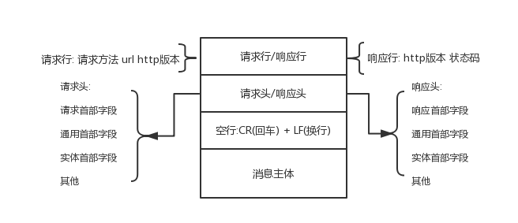

# HTTP小结
## 前言
    HTTP内容会很多，但是理解主要的内容即可
## 正文
### 一、HTTP的特点
http是一个无状态、持久连接、管线化的协议。
    
- 无状态: 由于每一次http请求都与上一个请求无任何关联，所以HTTP的是无状态的，这样可以使得实现变的简单，缺点就是无法保存状态(可以通过session和cookie来完成状态保存)
- 持久连接: 由于每次客户端和服务端进行请求的时候都要先进行三次握手，如果频繁的进行三次握手会很浪费时间和资源，所以在http1.1开始http请求默认是持久连接
- 管线化: 将多个http整批提交的技术，不需要等待服务端的响应，可以大大减少请求的时间；这个技术要在永久连接（persistent connection，http1.1的特性）的情况下进行，且仅支持GET和HEAD方法。
### 二、HTTP的构成

    

### 三、HTTP请求方法
    HTTP1.0只有 GET、POST和HEAD方法，而HTTP1.1增加了PUT、DELETE、OPTIONS、TRACE和CONNECT方法
- GET 请求指定页面信息，并返回实体主体
- POST 向指定资源提交数据进行处理请求
- PUT 从客户端向服务器传送数据取代指定的文档的内容
- OPTIONS  运行客户端查看服务器的性能
- HEAD 类似GET请求，只不过返回的响应中没有具体内容，用于获取报头
- DELETE 请求服务器删除指定内容
- TRACE 回显服务器收到的请求，主要用于测试或诊断
- CONNECT HTTP1.1预留给能够将连接改为管道方式的代理服务器

### 四、重要的状态码
#### 1xx(临时响应)
    表示临时响应并需要请求者继续执行操作的状态码

- 100 Continue 继续 请求者应当继续提出请求，服务器返回此状态码表示收到请求的第一部分，正在等待其余部分
- 101 Switching Protocols 切换协议 请求者已要求服务器切换协议，服务器已确认并准备切换
#### 2xx(成功)
    表示成功处理请求的状态码
- 200 OK 成功
- 201 Created 已创建 请求成功并且服务器创建了新的资源
- 202 Accepted 已接收 服务器已接收请求，但尚未处理
- 203 NonAuthoritative 非授权信息 服务器已经成功处理了请求，但返回的信息可能来自另一个源
- 204 No Content 无内容 服务器成功处理请求，但没有返回任何内容
- 205 Reset Content 重置内容 服务器成功处理了请求，
- 206 Partial Content 部分内容 服务器成功处理了部分get请求
#### 3xx(重定向)
    表示要完成请求，需要进一步操作。通常，这些状态码用来重定向
- 300 Multiple Choices  多种选择 针对请求，服务器可执行多种操作
- 301 Moved Permanently 永久移动 请求的网页已永久移动到新的位置
- 302 Found 临时移动 服务器目前从不同位置的网页响应请求，但请求者应当继续使用原来位置来继续以后的请求
- 303 see other 查看其它位置 请求者应当对不同的位置使用单独的GET请求来检索响应时，服务器返回此状态码
- 304 Not Modified 未修改 自动上次的请求，请求的网页未修改。
- 305 Use Proxy 使用代理 请求者只能使用代理访问请求的网页。
- 307 Temporary Redirect 临时性重定向 服务器目前从不同位置的网页响应请求，但请求者应当继续使用原有位置继续以后的请求
#### 4xx(请求错误) 
    表示请求可能出错，妨碍了服务器的处理
- 400 Bad Request 错误请求 服务器不理解请求的语法
- 401 Unauthorized 未授权 请求要求身份验证
- 403 Forbidden 禁止 服务器拒绝请求
- 404 Not Found 未找到 服务器找不到请求的资源
- 405 Method Not Allowed 方法禁用 禁用请求中指定的方法
- 406 Not Acceptable 不接受 无法使用请求的内容特性响应请求的资源
- 407 Proxy Authentication Required 需要代理授权 与401类型，但指定请求者应当授权使用代理
- 408 Request Timeout 请求超时 服务器等待请求时发生超时
- 409 Confilct 冲突 服务器在完成请求时发生冲突
- 410 Gone 已删除 表示请求资源已永久删除
- 411 Length Required  需要有效长度 服务器不接受不含有效内容长度标头字段的请求
- 412 Precondition Failed 为满足前提条件 服务器为满足请求者在请求中设置的其中的一个前置条件
- 413 Request Entity Too Large 请求实体过大 请求实体过大，超出服务器处理能力
- 414 Request-URI Too Large 请求URI过长 请求URI过长，服务器无法处理
- 415 Unsupported Media Type 不支持媒体类型 请求的格式不受支持
- 416 Requsted range not satisfiable 请求范围不符合要求
- 417 Expectation Failed 未满足期望值 服务器为满足“期望”请求标头字段的要求
#### 5xx(服务器错误)
    表示服务器尝试处请求时发生内部错误，这些错误可能是服务器本身的错误，而不是请求的错误
- 500 Internal Server 服务器内部错误
- 501 Not Implemented 尚未实施 服务器不具备完成请求的功能
- 502 Bad GateWay 错误网关 服务器作为网关或代理，从上游服务器无法收到无效响应
- 503 Service Unavailable 服务器不可用 服务器目前无法使用
- 504 Gateway Time-out 网关超时 服务器作为网关代理，但是没有及时从上游服务器接收到请求
- 505 HTTP Version not supported HTTP版本不受支持

## 参考文章
- [HTTP管线化(HTTP pipelining)](https://blog.csdn.net/dongzhiquan/article/details/6114040)
- [HTTP 状态码（HTTP Status Code）](https://blog.csdn.net/u014346301/article/details/53995333)
- [图解http（02）-http基础](https://blog.csdn.net/weixin_36244867/article/details/77963885)

- [菜鸟教程](http://www.runoob.com/http/http-methods.html)