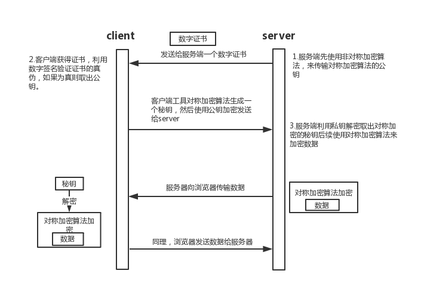

# https
## 前言
之前对https进行过了解，也就是一知半解不能对核心内容有自己的认识，这里还好整理一下。
## 正文
### 一、为什么会有https
使用传统的http协议是对数据进行明文传输，很容易被第三方劫持，获取传输数据或者对传输数据进行伪造，所以是既不安全的；而https是在http下加了一个SSL/TLS层，对传输数据进行进行加密，来完成数据传输的安全性的。

    

### 二、具体使用到的加密算法
#### 1.对称加密算法
对称加密顾名思义，加密和解密的秘钥是一致的，对称加密的优点就是：加密/解密的速度快、计算量小和加密效率高的特点；缺点：1）对称加密的由于加密解密都用同一把秘钥，如何把秘钥安全的发生给客户端就成了问题；2）每个客户端与服务端通信的时候，所用的秘钥必须是唯一的，由于服务端面向的用户是大量的，所需要维护的秘钥也就是大量的，顾对服务器对秘钥的维护会消耗大量的性能。

#### 2.非对称加密算法
非对称加密的原理是，有两把秘钥，一把公钥（对外公开）和一把私钥（不对外公开），一般使用公钥加密数据，私钥进行解密，也可以私钥加密，公钥进行解密；优点：1）安全性好；2）不需要维护大量的秘钥，只需一把公钥和私钥即可；缺点：1）算法比较复杂，cpu计算消耗比较大；2）对加密内容有长度限制，不适合对数据量比较大的信息进行加密。

#### 3.组合使用
由于两种加密算法都有优缺点，而在频繁数据的数据传输的时候明显对称加密，更加胜任，但是如何对安全传输对称秘钥；结合非对称加密的特点来解决，首先使用非对称加密将对称加密的秘钥传输给客户端，以后通信则使用对称加密进行，这样就能很好解决上面的问题。

### 三、CA（Certificate Authority/证书）和数字签名

#### 1.考虑存在的问题
在一些极端的情况下，客户端和服务端进行通信的时候，第三方也会对http响应进行拦截，然后将公钥进行替换，客户端不知道这个公钥是否是安全的，会继续使用公钥发送请求，然后第三方又将请求拦截，用自己的私钥把内容解密出来，然后对内容进行替换，再自己用正确的公钥加密，发送给服务端，这样也会导致数据被操纵。

>其实上面的这个正规的叫法为中间人拦截
#### 2.解决方案
通过上面提出的问题，我们知道问题点就是，浏览器无法知道获取的公钥是否准确，响应的服务器是非合法；这里就需要进行认真了，服务端到一些权威的机构去进行认证，然后认证机构会颁发一个数字证书，数字证书里面主要有两个消息：1）服务端的信息（域名、公钥）；2）数字签名；而其中的数字签名则是被认证机构使用私钥进行加密过的（防止被篡改）。

    

所以浏览在获取公钥的的时候回对服务端发来的数字证书进行认证，而认证的办法就是通过数字签名，通过到颁发的机构获取公钥，将数字签名进行解密，然后将解密的获取到真正的签名，然后浏览器再通过获取的信息对签名进行生成，最后对比签名是否一致，如果一致则取出公钥进行后续的数据传输，如果不一致则认证失败，不进行数据传输。

    

> ps：为什么要有数字签名呢？首先中间人也可以去进行认证，在拦截以后对对证书内容进行更改或者替换，但是请求的域名和数字签名无法改变，所以无论如何都会认证失败。
## 参考文章
- [看图学HTTPS](https://juejin.im/post/5b0274ac6fb9a07aaa118f49)
- [理解 HTTPS](https://juejin.im/entry/57138b128ac24700647155d7)