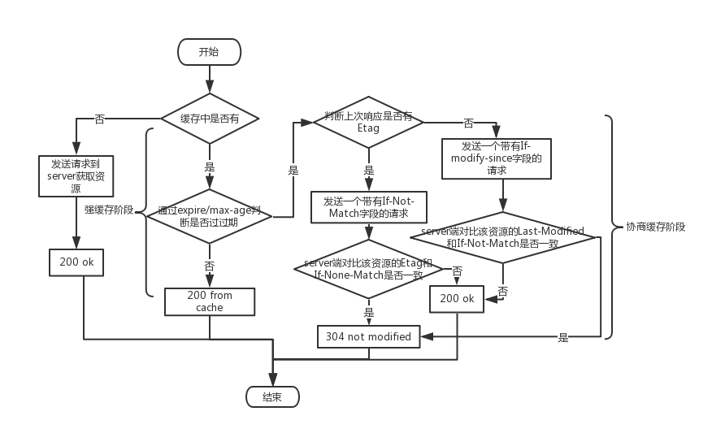

# 关于缓存
## 前言
缓存其实是非常重要的一个知识点，只要理解好缓存在http1.0和http1.1的区别，以及强缓存和协商缓存的区别即可
## 正文
### 一、为什么使用缓存
众所周知使用浏览器浏览的资源都来自服务器，假设没有缓存，每次当前页面的内容有所改变（不严谨，内容指资源）就会有发送请求去获取，这样在浏览一个资源比较多的网页，切换的时候都会因为要去请求大量的服务器资源导致页面展示会很慢，哪怕后退操作也会去请求，这就何谈在web上进行一些更加复杂的操作（你的用户已经跑了，操作2s没有加载出来我会认为这个页面加载不出来了）；所以缓存的出现就是为了解决这方面的问题。

使用缓存的优点：1）加快资源的获取速度，使用户体验更好；2）减轻服务的压力，利用缓存减少处理一下不必要的缓存资源。我们通常说所的缓存是指浏览器的缓存，而缓存从宏观上说分为两种：1）私有缓存，用户专享，不能被代理服务器缓存；2）共享缓存，能被各级服务器缓存的缓存。微观上则有：1）浏览器缓存；2）代理服务器缓存；3）网关缓存（也称为代理缓存或者反向代理缓存）；4）数据库缓存（对一些查询操作进行缓存）。
### 二、强缓存和协商缓存
    强缓存和协商缓存其实只是缓存的某个阶段，可以指定使用哪个阶段
#### 1.强缓存
当浏览器在请求一个资源的时候，先查看本地或者代理服务器上是否有该缓存资源，如果有则查看上次请求响应头部是否有expire和max-age，如果都有则先使用max-age为标准，max-age是个相对时间是http 1.1新增的cache-control中的属性，而expire是和http 1.0的字段，表示一个绝对时间，两个字段都是用来标记缓存资源的有效时间，如果对比过后没有过期，则使用缓存资源，这个过程则是强缓存阶段，如果缓存资源过期过后则进入协商缓存阶段。

>ps：为什么先使用max-age？由于expire是个绝对时间，它会读取本地的时间进行对比，而考虑到本地时间可能会出现差错，所以使用max-age的相对时间可以避免这个问题。
#### 2.协商缓存
当缓存资源过期过后，为了最大程度的利用缓存资源，会发送请求去验证缓存资源是否有效；主要通过上次响应中的Etag和Last-Modified字段，同理如果同时存在则先使用Etag，Etag字段是http 1.1新增的字段，它是服务端通过特点的算法对资源内容生成的唯一标识符，此时请求中加入一个If-None-Match字段，且内容为Etag的内容，server端接收过后进行对比Etag和If-None-Match内容是否一致，如果一致则返回304并更新缓存的有效期，如果不一致则返回200并更新缓存内容；Last-Modified则是http 1.0的字段，它代表缓存最后一次修改的时间，同理请求字段中加入If-Modified-Since并将Last-Modified的内容置入，sever端接收过后对比If-Modified-Since和Last-Modified是否一致即可，同理判断返回200或者304。

>ps:为什么先使用Etag，由于Last-Modified字段代表资源最后修改的时间，而资源可能只是文件名改变，而实际内容并没有改变；而Etag是根据资源内容生成的唯一标识，能在一定程度上反映资源的状态，可以说Etag相比Last-Modified来说更最大化的利用了缓存。当然如果开发者想更新用户或则代理服务器上的缓存资源，通过Last-Modified和更改资源名称会更加快速和直接。

>当经过强缓存阶段后如果缓存资源没有过期，会返回200 from cache，实际上有两种情况from disk cache（磁盘）和from memory cache（内存），这个其实浏览器会根据情况而定，如果缓存资源经常被使用到，则会存放到内存中，否则则存放到磁盘中，两种方式的不同点就是读取速度不同，但是因为都在本地，读取时间差异其实不会影响太多。
### 三、cache-control
    cache-control有很多重要的属性，全面的理解会有很大的帮助。

名称 | 说明
:---- | :----
public | 所有内容都将被缓存（可以被浏览器和代理服务器缓存）
private | 内容只缓存到私有缓存中
no-cache | 每次使用缓存的时候，都要先想服务器对资源进行验证（可以理解为强制进行协商缓存）
no-store | 所以内容不能被缓存
max-age | 一个绝对时间，在这个时间过后，缓存资源失效

## 参考文章
- [缓存详解](https://juejin.im/post/5a6c87c46fb9a01ca560b4d7)
- [百度百科](https://baike.baidu.com/item/Cache-control/1885913?fr=aladdin)
