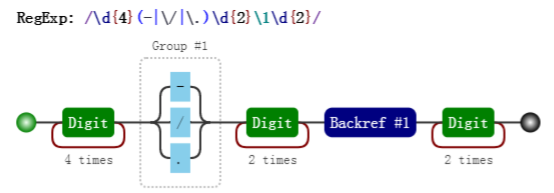

# 括号

**对括号的使用是否得心应手，是衡量对正则的掌握水平的一个侧面标准。**

括号的作用，其实三言两语就能说明白，括号提供了分组，便于我们引用它。

引用某个分组，会有两种情形：在 `JavaScript` 里引用它，在正则表达式里引用它。

## 分组和分支结构

这二者是括号最直觉的作用，也是最原始的功能，强调括号内的正则是一个整体，即提供子表达式。

### 分组

我们知道 `/a+/` 匹配连续出现的 `"a"`，而要匹配连续出现的 `"ab"` 时，需要使用 `/(ab)+/`

其中括号是提供分组功能，使量词 `+` 作用于 `"ab"` 这个整体，测试如下：

```js
var regex = /(ab)+/g;
var string = "ababa abbb ababab";
console.log( string.match(regex) );
// => ["abab", "ab", "ababab"]
```

### 分支结构

而在多选分支结构 `(p1|p2)` 中，此处括号的作用也是不言而喻的，提供了分支表达式的所有可能。

比如，要匹配如下的字符串：

`I love JavaScript I love Regular Expression`

可以使用正则：

```js
var regex = /^I love (JavaScript|Regular Expression)$/;
console.log( regex.test("I love JavaScript") );
console.log( regex.test("I love Regular Expression") );
// => true
// => true
```

如果去掉正则中的括号，即：

`/^I love JavaScript|Regular Expression$/`

匹配字符串是 `"I love JavaScript"` 和 `"Regular Expression"`，当然这不是我们想要的

## 分组引用

这是括号一个重要的作用，有了它，我们就可以**进行数据提取，以及更强大的替换操作**。

而要使用它带来的好处，必须配合使用实现环境的 `API`。

以日期为例。假设格式是 `yyyy-mm-dd` 的，我们可以先写一个简单的正则：

`var regex = /\d{4}-\d{2}-\d{2}/`

然后再修改成括号版的：

`var regex = /(\d{4})-(\d{2})-(\d{2})/`

```进行可视化```

我们发现，与前者相比，后者多了分组编号，如 `Group #1`

**其实正则引擎也是这么做的，在匹配过程中，给每一个分组都开辟一个空间，用来存储每一个分组匹配到的 数据。**

### 提取数据

既然分组可以捕获数据，那么我们就可以使用它们。比如提取出年、月、日，可以这么做：

```js
var regex = /(\d{4})-(\d{2})-(\d{2})/;
var string = "2017-06-12";
console.log( string.match(regex) );
// => ["2017-06-12", "2017", "06", "12", index: 0, input: "2017-06-12"]
```

NOTE

**`match` 返回的一个数组，第一个元素是整体匹配结果，然后是各个分组（括号里）匹配的 内容，然后是匹配下标，最后是输入的文本。另外，正则表达式是否有修饰符 `g`，`match` 返回的数组格式是不一样的。**

```js
var regex = /(\d{4})-(\d{2})-(\d{2})/;
var string = "2017-06-12";
console.log( string.match(regex) );
// => ["2017-06-12", "2017", "06", "12", index: 0, input: "2017-06-12", groups: undefined]

var regex = /(\d{4})-(\d{2})-(\d{2})/g;
var string = "2017-06-12";
console.log( string.match(regex) );
// => ["2017-06-12"]
```

另外也可以使用正则实例对象的 `exec` 方法：

```js
var regex = /(\d{4})-(\d{2})-(\d{2})/;
var string = "2017-06-12";
console.log( regex.exec(string) );
// => ["2017-06-12", "2017", "06", "12", index: 0, input: "2017-06-12", groups: undefined]

var regex = /(\d{4})-(\d{2})-(\d{2})/g;
var string = "2017-06-12";
console.log( regex.exec(string) );
// => ["2017-06-12", "2017", "06", "12", index: 0, input: "2017-06-12", groups: undefined]
```

同时，也可以使用构造函数的全局属性 `$1` 至 `$9` 来获取：

```js
var regex = /(\d{4})-(\d{2})-(\d{2})/;
var string = "2017-06-12";
regex.test(string);
// 正则操作即可，例如regex.exec(string);string.match(regex);
console.log(RegExp.$1); // "2017"
console.log(RegExp.$2); // "06"
console.log(RegExp.$3); // "12"
```

### 替换

比如，想把 `yyyy-mm-dd` 格式，替换成 `mm/dd/yyyy` 怎么做

```js
var regex = /(\d{4})-(\d{2})-(\d{2})/;
var string = "2017-06-12";
var result = string.replace(regex, "$2/$3/$1");
console.log(result); // => "06/12/2017"
```

其中 `replace` 中的，第二个参数里用 `$1、$2、$3` 指代相应的分组。等价于如下的形式：

```js
var regex = /(\d{4})-(\d{2})-(\d{2})/;
var string = "2017-06-12";
var result = string.replace(regex, function () {
  return RegExp.$2 + "/" + RegExp.$3 + "/" + RegExp.$1;
});
console.log(result);
// => "06/12/2017"
```

也等价于：

```js
var regex = /(\d{4})-(\d{2})-(\d{2})/;
var string = "2017-06-12";
var result = string.replace(regex, function (match, year, month, day) {
  return month + "/" + day + "/" + year;
  });
console.log(result); // => "06/12/2017"
```

## 反向引用

!!TODO:FIXME:

除了使用相应 `API` 来引用分组，也可以在正则本身里引用分组。但只能引用之前出现的分组，即反向引用。

还是以日期为例，比如要写一个正则支持匹配如下三种格式：

```js
2016-06-12
2016/06/12
2016.06.12
```

最先可能想到的正则是:

```js
var regex = /\d{4}(-|\/|\.)\d{2}(-|\/|\.)\d{2}/;
var string1 = "2017-06-12";
var string2 = "2017/06/12";
var string3 = "2017.06.12";
var string4 = "2016-06/12";
console.log( regex.test(string1) );
// true
console.log( regex.test(string2) );
// true
console.log( regex.test(string3) );
// true
console.log( regex.test(string4) );
// true
```

其中 `/` 和 `.` 需要转义。虽然匹配了要求的情况，但也匹配 `"2016-06/12"` 这样的数据。

**假设我们想要求分割符前后一致怎么办？** 此时需要使用反向引用：

```js
var regex = /\d{4}(-|\/|\.)\d{2}\1\d{2}/;
var string1 = "2017-06-12";
var string2 = "2017/06/12";
var string3 = "2017.06.12";
var string4 = "2016-06/12";
console.log( regex.test(string1) );
// true
console.log( regex.test(string2) );
// true
console.log( regex.test(string3) );
// true
console.log( regex.test(string4) );
// false
```

其可视化形式是：



注意里面的 `\1`，表示的引用之前的那个分组 `(-|\/|\.)`。不管它匹配到什么（比如 `-`），`\1` 都匹配那个同 样的具体某个字符。
我们知道了 `\1` 的含义后，那么 `\2` 和 `\3` 的概念也就理解了，即分别指代第二个和第三个分组。

### 括号嵌套的情况

**以左括号（开括号）为准**。比如：

```js
var regex = /^((\d)(\d(\d)))\1\2\3\4$/;
var string = "1231231233";
console.log( regex.test(string) );
// true
console.log( RegExp.$1 );
// 123
console.log( RegExp.$2 );
// 1
console.log( RegExp.$3 );
// 23
console.log( RegExp.$4 );
// 3
```

我们可以看看这个正则匹配模式：

- 第一个字符是数字，比如说 `"1"`，
- 第二个字符是数字，比如说 `"2"`，
- 第三个字符是数字，比如说 `"3"`，
- 接下来的是 `\1`，是第一个分组内容，那么看第一个开括号对应的分组是什么，是 `"123"`，
- 接下来的是 `\2`，找到第2个开括号，对应的分组，匹配的内容是 `"1"`，
- 接下来的是 `\3`，找到第3个开括号，对应的分组，匹配的内容是 `"23"`，
- 最后的是 `\4`，找到第3个开括号，对应的分组，匹配的内容是 `"3"`。


### 引用不存在的分组会怎样

因为反向引用，是引用前面的分组，但我们在正则里引用了不存在的分组时，此时正则不会报错，只是匹配 反向引用的字符本身。例如 `·`，就匹配 `"\2"`。注意 `"\2"` 表示对 `"2"` 进行了转义。

```js
var regex = /\1\2\3\4\5\6\7\8\9/;
console.log( regex.test("\1\2\3\4\5\6\7\8\9") );
// ture
console.log( "\1\2\3\4\5\6\7\8\9".split("") );
// ["", "", "", "", "", "", "", "8", "9"]

```

### 分组后面有量词会怎样

分组后面有量词的话，分组最终捕获到的数据是**最后一次的匹配**。比如如下的测试案例：

```js
var regex = /(\d)+/;
var string = "12345";
console.log( string.match(regex) );
// => ["12345", "5", index: 0, input: "12345"]
```

从上面看出，分组 `(\d)` 捕获的数据是 `"5"`

同理对于反向引用，也是这样的。测试如下：

```js
var regex = /(\d)+ \1/;
console.log( regex.test("12345 1") );
// => false
console.log( regex.test("12345 5") );
// => true
```

## 非捕获括号

之前文中出现的括号，都会**捕获它们匹配到的数据，以便后续引用**，因此也称它们是**捕获型分组和捕获型分支**。

如果只想要括号最原始的功能，但不会引用它，即，既不在 API 里引用，也不在正则里反向引用。在开括号后面加`?:`

`(?:)`

此时可以使用非捕获括号 `(?:p)` 和 `(?:p1|p2|p3)`，例如本章第一个例子可以修改为：

```js
var regex = /(?:ab)+/g;
var string = "ababa abbb ababab";
console.log( string.match(regex) );
// => ["abab", "ab", "ababab"]
```

同理，第二例子可以修改为：

```js
var regex = /^I love (?:JavaScript|Regular Expression)$/;
console.log( regex.test("I love JavaScript") );
console.log( regex.test("I love Regular Expression") );
// => true
// => true
```
