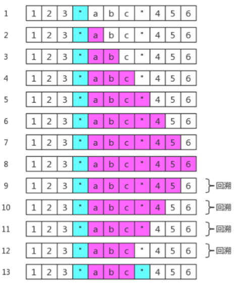
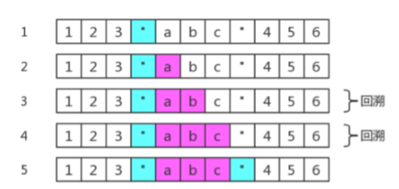

# 构建一个合适的正则表达式

对于一门语言的掌握程度怎么样，可以有两个角度来衡量：读和写。不仅要看懂别人的解决方案，也要能独立地解决问题。代码是这样，正则表达式也是这样。与“读”相比，“写”往往更为重要，这个道理是不言而喻的。
对正则的运用，首重就是：如何针对问题，构建一个合适的正则表达式？

## 平衡法则

构建正则有一点非常重要，需要做到下面几点的平衡：

- 匹配预期的字符串

- 不匹配非预期的字符串

- 可读性和可维护性

- 效率

## 构建正则的前提

### 是否能使用正则

正则太强大了，以至于我们随便遇到一个操作字符串问题时，都会下意识地去想，用正则该怎么做。但我们 始终要提醒自己，正则虽然强大，但不是万能的，很多看似很简单的事情，还是做不到的。

比如匹配这样的字符串：`1010010001…`。

虽然很有规律，但是只靠正则就是无能为力。

### 是否有必要使用正则

要认识到正则的局限，不要去研究根本无法完成的任务。同时，也不能走入另一个极端：无所不用正则。能 用字符串 API 解决的简单问题，就不该正则出马。

比如，从日期中提取出年月日，虽然可以使用正则：

```js
var string = "2017-07-01";
var regex = /^(\d{4})-(\d{2})-(\d{2})/;
console.log( string.match(regex) ); // => ["2017-07-01", "2017", "07", "01", index: 0, input: "2017-07-01"]
```

其实，可以使用字符串的 `split` 方法来做，即可：

```js
var string = "2017-07-01";
var result = string.split("-");
console.log( result ); // => ["2017", "07", "01"]
```

### 是否有必要构建一个复杂的正则

比如密码匹配问题，要求密码长度 6-12 位，由数字、小写字符和大写字母组成，但必须至少包括 2 种字 符。

在第2章里，我们写出了正则是：

`/(?!^[0-9]{6,12}$)(?!^[a-z]{6,12}$)(?!^[A-Z]{6,12}$)^[0-9A-Za-z]{6,12}$/`

其实可以使用多个小正则来做：

```js
var regex1 = /^[0-9A-Za-z]{6,12}$/;
var regex2 = /^[0-9]{6,12}$/;
var regex3 = /^[A-Z]{6,12}$/;
var regex4 = /^[a-z]{6,12}$/;
function checkPassword (string) {
  if (!regex1.test(string)) return false;
  if (regex2.test(string)) return false;
  if (regex3.test(string)) return false;
  if (regex4.test(string)) return false;
  return true;
}
```

## 准确性

所谓准确性，就是能匹配预期的目标，并且不匹配非预期的目标。

这里提到了“预期”二字，那么我们就需要知道目标的组成规则。

不然没法界定什么样的目标字符串是符合预期的，什么样的又不是符合预期的。

### 匹配固定电话

比如要匹配如下格式的固定电话号码：

`055188888888 0551-88888888 (0551)88888888`

第一步，了解各部分的模式规则

上面的电话，总体上分为区号和号码两部分（不考虑分机号和 "+86" 的情形）。

区号是 "0" 开头的 3 到 4 位数字，对应的正则是：`0\d{2,3}`，

号码是非 "0" 开头的 7 到 8 位数字，对应的正则是：`[1-9]\d{6,7}`

因此，匹配 `"055188888888"` 的正则是：`/^0\d{2,3}[1-9]\d{6,7}$/`

匹配 `"0551-88888888"` 的正则是：`/^0\d{2,3}-[1-9]\d{6,7}$/`，

匹配 `"(0551)88888888"` 的正则是：`/^\(0\d{2,3}\)[1-9]\d{6,7}$/`

第二步，明确形式关系

这三者情形是或的关系，可以构建分支

`/^0\d{2,3}[1-9]\d{6,7}$|^0\d{2,3}-[1-9]\d{6,7}$|^\(0\d{2,3}\)[1-9]\d{6,7}$/`

提取公共部分：

`/^(0\d{2,3}|0\d{2,3}-|\(0\d{2,3}\))[1-9]\d{6,7}$/`

进一步简写：

`/^(0\d{2,3}-?|\(0\d{2,3}\))[1-9]\d{6,7}$/`

上面的正则构建过程略显罗嗦，但是这样做，能保证正则是准确的。

上述三种情形是或的关系，这一点很重要，不然很容易按字符是否出现的情形把正则写成：

`/^\(?0\d{2,3}\)?-?[1-9]\d{6,7}$/`

虽然也能匹配上述目标字符串，但也会匹配 `"(0551-88888888"` 这样的字符串。当然，这不是我们想要的。

其实这个正则也不是完美的，因为现实中，并不是每个 3 位数和 4 位数都是一个真实的区号。

这就是一个平衡取舍问题，一般够用就行。

### 匹配浮点数

要求匹配如下的格式：

```js
1.23、+1.23、-1.23
10、+10、-10
.2、+.2、-.2
```

可以看出正则分为三部分

符号部分：`[+-]`
整数部分：`\d+`
小数部分：`\.\d+`

上述三个部分，并不是全部都出现。如果此时很容易写出如下的正则：

`/^[+-]?(\d+)?(\.\d+)?$/`

此正则看似没问题，但这个正则也会匹配空字符 ""

因为目标字符串的形式关系不是要求每部分都是可选的

要匹配 "1.23"、"+1.23"、"-1.23"，可以用`/^[+-]?\d+\.\d+$/`

要匹配 "10"、"+10"、"-10"，可以用`/^[+-]?\d+$/`

要匹配 ".2"、"+.2"、"-.2"，可以用`/^[+-]?\.\d+$/`

因此整个正则是这三者的或的关系，提取公众部分后是：

`/^[+-]?(\d+\.\d+|\d+|\.\d+)$/`

如果要求不匹配 "+.2" 和 "-.2"，此时正则变成：

`/^([+-]?(\d+\.\d+|\d+)|\.\d+)$/`

当然，`/^[+-]?(\d+\.\d+|\d+|\.\d+)$/` 也不是完美的，我们也是做了些取舍，比如：

它也会匹配 "012" 这样以 "0" 开头的整数。如果要求不匹配的话，需要修改整数部分的正则。

一般进行验 证操作之前，都要经过 trim 和判空。

那样的话，也许那个错误正则也就够用了。

也可以进一步改写成：

`/^[+-]?(\d+)?(\.)?\d+$/`

这样我们就需要考虑可读性和可维护性了

## 效率

保证了准确性后，才需要是否要考虑要优化。大多数情形是不需要优化的，除非运行的非常慢。什么情形正 则表达式运行才慢呢？我们需要考察正则表达式的运行过程（原理）。

正则表达式的运行分为如下的阶段：

1. 编译
2. 设定起始位置
3. 尝试匹配
4. 匹配失败的话，从下一位开始继续第 3 步
5. 最终结果：匹配成功或失败

下面以代码为例，来看看这几个阶段都做了什么：

```js
var regex = /\d+/g;
console.log( regex.lastIndex, regex.exec("123abc34def") );
console.log( regex.lastIndex, regex.exec("123abc34def") );
console.log( regex.lastIndex, regex.exec("123abc34def") );
console.log( regex.lastIndex, regex.exec("123abc34def") );
// => 0 ["123", index: 0, input: "123abc34def"]
// => 3 ["34", index: 6, input: "123abc34def"]
// => 8 null
// => 0 ["123", index: 0, input: "123abc34def"]
```

具体分析如下：

`var regex = /\d+/g;`

当生成一个正则时，引擎会对其进行编译。报错与否出现这这个阶段。

`regex.exec("123abc34def")`

当尝试匹配时，需要确定从哪一位置开始匹配。一般情形都是字符串的开头，即第 0 位。

但当使用 `test` 和 `exec` 方法，且正则有 g 时，起始位置是从正则对象的 `lastIndex` 属性开始。

因此第一次 `exec` 是从第 0 位开始，而第二次是从 3 开始的。

设定好起始位置后，就开始尝试匹配了。

比如第一次 `exec`，从 0 开始，去尝试匹配，并且成功地匹配到 3 个数字。此时结束时的下标是 2，因此下 一次的起始位置是 3。

而第二次，起始下标是 3，但第 3 个字符是 "a"，并不是数字。但此时并不会直接报匹配失败，而是移动到 下一位置，即从第 4 位开始继续尝试匹配，但该字符是 "b"，也不是数字。

再移动到下一位，是 "c" 仍不 行，再移动一位是数字 "3"，此时匹配到了两位数字 "34"。

此时，下一次匹配的位置是 "d" 的位置，即第 8 位。

第三次，是从第 8 位开始匹配，直到试到最后一位，也没发现匹配的，因此匹配失败，返回 `null`。同时设 置 `lastIndex` 为 0，即，如要再尝试匹配的话，需从头开始。

从上面可以看出，匹配会出现效率问题，主要出现在上面的第 3 阶段和第 4 阶段。

因此，主要优化手法也是针对这两阶段的。

### 使用具体型字符组来代替通配符，来消除回溯

而在第三阶段，最大的问题就是回溯。
例如，匹配双引用号之间的字符。如，匹配字符串 `123"abc"456` 中的 `"abc"`。

如果正则用的是：`/".*"/`，会在第 3 阶段产生 4 次回溯（粉色表示 `.*` 匹配的内容）：



如果正则用的是：`/".*?"/`，会产生 2 次回溯（粉色表示 `.*?` 匹配的内容）：



因为回溯的存在，需要**引擎保存多种可能中未尝试过的状态，以便后续回溯时使用。注定要占用一定的内存**

此时要使用具体化的字符组，来代替通配符.，以便消除不必要的字符，此时使用正则 `/"[^"]*"/`，即可。

### 使用非捕获型分组

因为括号的作用之一是，可以捕获分组和分支里的数据。那么就**需要内存**来保存它们。

当我们不需要使用分组引用和反向引用时，此时可以**使用非捕获分组**。

例如，`/^[-]?(\d\.\d+|\d+|\.\d+)$/` 可以修改成：`/^[-]?(?:\d\.\d+|\d+|\.\d+)$/`。

### 独立出确定字符

例如，`/a+/` 可以修改成 `/aa*/`

因为后者能比前者多确定了字符 `"a"`。这样会在第四步中，加快判断是否匹配失败，进而加快移位的速度

### 提取分支公共部分

比如，`/^abc|^def/` 修改成 `/^(?:abc|def)/`

又比如， `/this|that/` 修改成 `/th(?:is|at)/`

这样做，可以减少匹配过程中可消除的重复

### 减少分支的数量，缩小它们的范围

`/red|read/` 可以修改成 `/rea?d/`

此时分支和量词产生的回溯的成本是不一样的。但这样优化后，可读性会降低的。

## 小结

一般情况下，针对某问题能写出一个满足需求的正则，基本上就可以了。

至于准确性和效率方面的追求，纯属看个人要求了。我觉得够用就行了。

关于准确性，本章关心的是最常用的解决思路：

**针对每种情形，分别写出正则，然用分支把它们合并在一起，再提取分支公共部分，就能得到准确的正则。**

至于优化，本章没有为了凑数，去写一大堆。了解了匹配原理，常见的优化手法也就这么几种。
