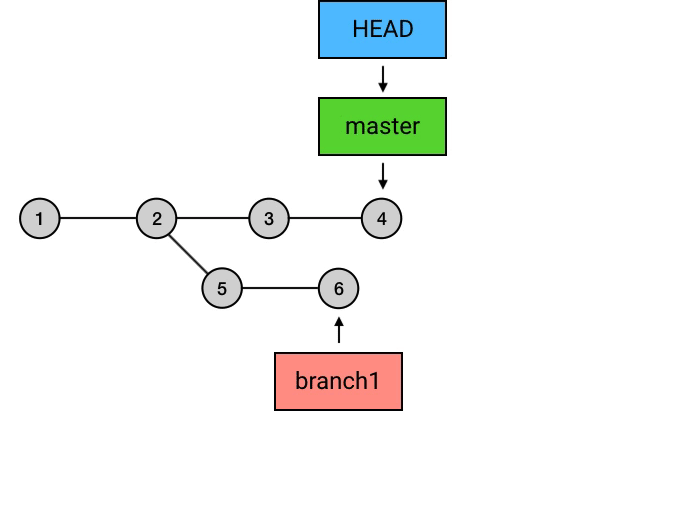

# git小总
## 前言
    git平时会开发会用到的技术，由于自己学艺不精，导致在实习工作的时候经常出差错，汗颜只能重新来过，希望能够好好的掌握这项技术。

## 正文
### 一、什么是git
    git是一个分布式版本管理系统（DVCS），而版本管理系统的特点是：版本控制、主动提交、中央仓库。

最初的时候最流行的是中心版本管理系统（CVCS）,CVCS的特点是只有一个仓库，这个仓库为中央仓库，所以在进行开发的时候，不能频繁的进行提交，一般都是在完成一定功能后再向中央仓库；DVCS的区别在于允许开发者拥有本地仓库，先从中央仓库中克隆下一个仓库，然后在本地仓库上进行代码的版本控制，在把本地仓库的控制记录同步到中央仓库，这样就能完成开发中的任务。

可以看出DVCS的对CVCS来说有很多优点，比如：1）不需要联网就能进行版本控制，能够随时的对代码就行review或者提交，2）由于拥有本地仓库，所以可以频繁的进行提交，将每个提交做的更加细致。

### 二、传统的git工作流程
在使用git进行版本控制的时候，我们总是先从中央仓库克隆或者本地新建一个仓库为开始，然后每次更改通过add命令进行添加到暂存区，然后通过commit命令进行提交，提交后你的项目历史就会多一个commit的历史，在多次commit的后通过push将本地的提交同步到中央仓库，平时多人协同开发，会出现中央仓库的提交历史在本地没有（你同事提交的），这个时候通过pull命令将中央仓库的历史拉下来，然后在merge本地历史后，再push到中央仓库中，整个过程大概就是最基本的git的工作流程。
### 三、工作目录、暂存区
#### 1.工作目录
通过名字可以简单的理解，工作目录是指当前项目的状态，可以理解为项目中每个文件的真正的状态，因为在进行git的一些操作的时候回影响到工作目录，比如在回滚的时候有的回保存当前工作目录，即当前的提交和更改在回滚后都会保存在工作目录上，而有的回滚操作则回以回滚后的提交的项目状态作为工作目录。可以通过git status来查看工作目录的状态。
#### 2.暂存区
git会对有变动的文件进行标记，有四种状态changed/unstaged(已修改未暂存)、staged(已修改并暂存)、commited（已提交）和untracked（未跟踪的状态）；git的暂存区可以理解为`集中收集改的以待提交`，工作目录的更改都需要先提交到暂存区，然后才能被提交，所以暂存区可以理解为收集本次提交需要更改的文件。staging area是.git目录下的一个叫index的文件，工作目录的中的更改需要通过add命令将更改添加到暂存区中，以待提交。
### 四、commit、HEAD和branch
前面提到git的每次commit都会想添加一个提交历史，而每个commit都有一个字符串与之关联，可以理解为他的一个指针，他是一个SHA-1校验和，两个SHA-1的重复率极低，所以可以将这个代表commit的引用。

HEAD是指向当前的commit引用，即当前工作目录所对应的commit，而每次添加新的提交以后HEAD会自动移动到最新的commit上。branch也是git中commit的引用，和HEAD不同，他不是唯一的（多个分支嘛！）, 它可以理解为从初始commit到branch指向当前commit的一条路径/分支，一般来说branch指向每条分支最新的conmmit引用，而HEAD所在的分支，HEAD通过指向branch来间接指向commit的引用。

<div align=center>
    
</div>

### 五、关于push
push其实就是把当前分支上次到远程仓库，并把这个branch上所有commit一并上传，push的时候要先切换到需要push的分支，即将HEAD切换到对应的branch上，如果远程仓库没有这个分支，那么push的时候要指定分支的name,且必须和本地的一致，这样远程仓库就能创建这个分支并将对应的commit push到这个分支上。
``` shell
git checkout feature1
git push origin feature1
```
### 六、关于merge
#### merge的含义和使用场景
merge会将当前的commit和目标commit的中的所对应的工作目录内容合并成一个新的commit，并添加到目前的commit的前面；merge主要两个作用：1）合并分支；2）合并远程仓库的提交，即在git pull的时候会先执行git fetch然后执行git merge。
#### 关于冲突
在merge的时候出现了当前commit和目标commit都修改了同一个文件，如果两者修改的内容不是同一位置，git则会自动合并两者的修改都保存；而如果修改的位置重合了这个时候就会出现冲突（Conflict）。

git会在冲突的位置添加上标记，这个时候只需要手动修改即可，其中`<<<HEAD到===`表示当前commit的修改，`===到>>>target`表示目标commit的修改，选择好想要保存的修改，然后将剩余的部分删除即可（包括<<<、>>>、HEAD、target、丢弃的修改的内容）。

<div align=center>

</div>

修改完以后记得重新add到暂存区然后commit，而这个时候git会自动给你填写提交信息，因为在merge出现冲突以后，git仓库会处于一个`merge冲突待解决`的中间状态，在这种状态下的commit，git会自动帮你添加这个是一个merge commit的提交信息。如果不想解决冲突，则使用`git merge --abort`，它会让git仓库回滚到merge前的状态。

几种特殊merge
- 当前commit在目标commit前（两个commit都在一个分支上），这个时候会执行一个空操作，即什么也不做
- 当前commit在目标commit之后（两个commit都在一个分支上），这个时候目标当前的commit上的branch和HEAD会快速移动到目标commit，这个时候相当于目标commit就是当前commit了，这种操作饺子`fast-forward`（快速移动），主要出现在远程仓库的commit记录多余本地的时候，在git pull的时候会出现这种操作。
### 七、关于add
我们都知道执行git add能将工作目录的修改的文件添加到暂存区，而需要注意的是add添加的是具体文件改的，而不是具体的文件，比如当一个文件修改了并添加到了暂存区（为未commit），然后再次修改这个文件，此时查看工作目录（git status）会发现这个文件被标记为modified且未被staged，所以需要注意的是git的add对象是`文件改动而不是具体的文件`。
### 八、关于rebase
rebase一个类似merge的操作，不同的是他是将当前的分支和目标分支的交叉点开始，将当前的分支的commit添加到目标分支上，一定程度上相当于把当前commit分支上的commit添加到目标分支上，具体可以看下图；需要注意的是由于目标分支的branch还在原来位置，而HEAD还是指向当前branch（可以看出branch的引用概念在这里体现了，他不是一个具体固定的东西，他只是一个引用，开发者目的只是想用branch这个来表达分支的概念，其原理只是一个commit的引用，可以移动复制即使是跨分支的），所以要还有checkout到目标分支，然后merge一下，这个时候目标branch会 `fas-forward`到对应的分支上。这个时候当前分支有了想要合并分支的commit记录。

```shell
git checout branch1
git rebase master
git checout master
git merge  branch1
```

<div align=center>

</div>

###  九、reset和checkout
#### reset
reset命令一般用于回滚，这个操作会将当前的commit的HEAD和HEAD下的branch（如果有的话）一起移动到目标commit，这样就能实现回滚操作；在使用reset的时候有参数设置，不同的参数导致的最终结果不同：
- `--hard`，这个参数会重置工作目录，即当前工作目录的内容（即修改了未被暂存的）都会被抹去，工作目录重置为目标commit的内容。
- `--soft`，会保存工作目录和暂存区的内容，并将目标commit的工作目录的内容差异放入暂存区。
- `mixed`,不加参数的时候默认使用这个参数，它会保留工作目录，并清空暂存区。
#### checkout
意味签出，`git checkout branch`的本质是将HEAD的指向指定的branch，然后将工作目录变为对应commit的工作目录，checkout的目标其实是commit，所以可以使用commit作为目标，只是它只移动HEAD，不会移动branch;chekout还有一个功能是撤销暂存区的内容，通过`git checkout -- filename`命令实现。
### 十、一些技巧
####  1.修改当前commit的提交，不添加新的提交情况下
使用 `git commit --amend`命令，它会将当前的commit的内容和暂存区的内容合并，创建一个新的commit，然后替换掉当前的commit，相当于修改当前的commit，不会产生新的commit
#### 2.修改任意位置的commit
利用交互式rebase，即`git rebase -i/--interactive`，交互式rebase的特点是，在指向rebase操作之前，可以指定要rebase的commmit链中的每一个commit是否需要进一步修改；利用这个特点可以继续原地的rebase(即当前branch和目标branch为同一个branch)。

git rebase -i commit-SHA-1(要进行更改的commit),执行以后会进入下面的界面，而这个界面主要分为两个部分，第一部分是具体commit集合，这个是需要修改的commit到当前commit的集合，排序是由上到下，最上面是需要修改的commit，最下面是当前commit，每个commit前面有个指令表示要进行的操作；然后第二个部分为提示部分，主要是一些提示操作，如果要修改的是commit的message的话则切换到reword命令，如果要修改commit的内容的话则用edit命令，还有其他一些命令可以通过提示了解。

<div align=center>

</div>


当使用edit命令的时候，就会推出当前的界面，然后继续修改内容，然后使用`git commit--amend`来完成提交，最好再用git rebase --continue继续rebase，最好就完成了需要的修改。

    做一下讲解，交互式rebase主要用到了在rebase之前有个课编辑commit的操作，而在同一个分支上rebase，相当于一个空操作，即当前commit到目标commit的交叉处的commit合集会添加到目标commit上，则本来就是有的，而执行后的HEAD还是指向原来的commit，所以说是一个空操作。
#### 3.丢弃当前的commit
使用 `git reset --hard`，这个操作会将HEAD和branch向后移动一位，这样前面的commit没有被引用，相当于丢弃了。
    注意：在git中没有真正意义上删除commit或者分支，只是对应的commit不在被引用，在一段时间后git会将其回收，所以要找回之前删除的commit的要乘早。
#### 4.丢弃某一个commit
还是利用交互式rebase，在调整界面将commit集合中要删除的commit直接去掉就好（就是通过BackSpace这个键，将集合上的commit去掉）
#### 5.错误代码已经push到远程仓库了
如果不是master分支的话，则先在本地修改好commit，如果使用传统的直接push的话，由于远程仓库的commit与本队有区别则会要求你想pull下来然后merage，这样的那个错误的commit还是存在在远程仓库；利用`git push origin branch1 -f`进行push，它会强制将本地的该分支的commit集合覆盖远程仓库的分支，算是个危险操作，所以不要在master分支上进行；

如果是master的话 使用`git revert commit`命令，它相当于一个commit的反操作，即如果对应的commit做了什么，那么revert命令会想当前commit上添加一个commit这个commit的操作内容这是和对应的commit完全相反，就是中和效应一样的道理，这样做的好处在于不会影响master的提交记录，通过新增commit的方式完成修改。
#### 6.保证工作目录的骚操作
在某些场景比较急促，你没时间commit当前工作目录的更改，或者你不想commit一个功能实现不完整的commit，你又要转手到其他branch去做其他事情，那么使用`stash`，它能够保存工作目录的更改，使用`git stash`进行保存，到要来继续工作的时候使用`git stash pop`，真的骚。

    注意：git stash只会保存被track的内容，即暂存区的内容，使用`git stash -u`能将那些untrack的也被保存起来
### 十一、Feature Branching 最流行的工作流
通过利用git branch的特点，项目的每个feature、bug、test都使用一个分支独立开发，在开发完成后再merge到master上，这种开发模式能够快速多人的协同的完成同一个项目上不同工作的开发，而在正常开发的时候为了方便查询任务具体执行人和方便review，分支名都会加上具体的开发开始时间、开发者的名字、开发需求的代号，所以一般情况下，这个分支下的任务开发完成后也不会删除分支，这样久了分支数会非常的大，不知道对终端的性能是否会有影响；在实习工作的时候公司用的这种模式，当时没有注意，只觉得这样虽然方便，缺点就是导致分支过多。
### 十二、github和gitlab
github和gitlab可以说都是git的远程仓库的管理软件，区别在于gitlab可以自己部署，也就是能够自己部署到自己服务器上，现在很多公司用gitlab搭建自己的代码仓库，而github则相当于将仓库放在别人的服务器上统一管理，对公司来说不是很安全；但对开源或者个人来说这是一个很好的平台，大家都能去访问开源的项目的代码，大大提高了开源面向群众的机会，让开源能够有更多的人能够参加进来。

github相对来说不只是一个远程仓库的作用，它能够管理用户的仓库，能够统计用户的所以提交记录，每个仓库有issues能够让非贡献者参与项目的讨论，支持同fork将别人的仓库clone到用户的仓库目录下，通过pull request的将用户的commit提交给fork仓库的主人，主人根据情况会考虑是否merge你的提交，这种工作模式可以说极大提高了异地开发人员对某个需求的讨论。
## 参考文章
- [Git 原理详解及实用指南](https://juejin.im/book/5a124b29f265da431d3c472e)
