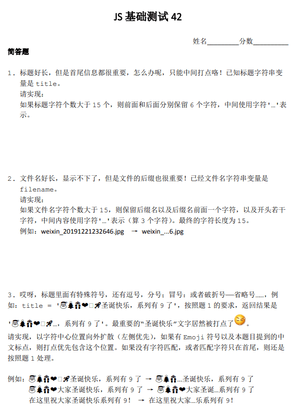

# t



## tt

```js
// 第一题
function elsMid(str, len) {
    var t = len || 15;
    if (str.length > t) {
        var after = parseInt(t / 2) - 1;
        return str.slice(0, t - after - 3) + '...' + str.slice(-after);
    }
    return str
}

console.log(elsMid('这是一段很长的文字，需要中间省略，因为首尾的信息都很重要'));

// 第二题
function elsFilename(str, len) {
    var t = len || 15;
    if (str.length > t) {
        var after = str.split('.').slice(-1)[0].length + 2; //最后一个点
        return str.slice(0, t - after - 3) + '...' + str.slice(-after);
    }
    return str
}

console.log(elsFilename('weixin_20191254656563.jpg'));
console.log(elsFilename('weixin_20191254611.bak.word'));

// 第三题
function elsEmoji(str, len) {
    var t = len || 15;
    var emojiArr = str.replace(/——|……|[^\ud83c|\ud83d]/g, function ($0) {
        if (/——|……/.test($0)) {
            return $0 + ',';
        }
        if (/[\u2000-\u2fff]/g.test($0)) {
            return $0
        }
        return $0 + ',';
    }).slice(0, -1).split(','); //转化成数组，不知道这样全不全

    if (emojiArr.length >= t) {
        var reg = /\uD83C[\uDF00-\uDFFF]|\uD83D[\uDC00-\uDE4F]|[\u2000-\u2fff]|——|……|，|：|；/g
        var mid = parseInt(emojiArr.length / 2);
        var before = emojiArr.slice(0, mid);
        var after = emojiArr.slice(mid);
        var index = 0;
        for (var i = 0; i < mid; i++) {
            if (reg.test(before[mid - i - 1])) {
                index = mid - i - 1;
                break;
            }
            if (reg.test(after[i])) {
                index = mid + i;
                break;
            }
        }

        var start = t - (emojiArr.length - index - 1) - 3;
        if (start <= 0 || index === emojiArr.length) {
            return elsMid(str);
        } else {
            return emojiArr.slice(0, start).join('') + '...' + emojiArr.slice(index + 1).join('');
        }
    }
    return str
}

console.log(elsEmoji('🎅🎄🎁❤️🚀🚀🚀圣诞快乐，系列有🚀了'))
console.log(elsEmoji('🎅🎄🎁❤️🚀❤️圣诞快乐，系列有🚀了'))
console.log(elsEmoji('🎅🎄🎁大家圣诞快乐——系列有🚀了'))
console.log(elsEmoji('🎅🎄🎁大家圣诞快乐❤️系列有🚀了'))
console.log(elsEmoji('🎅🎄🎁大家圣诞快乐……系列有🚀了'))
```
