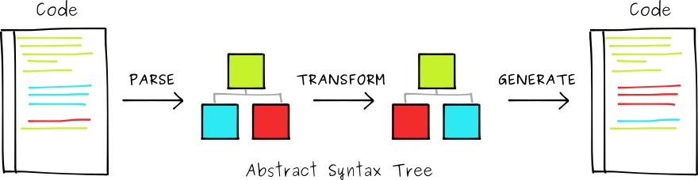
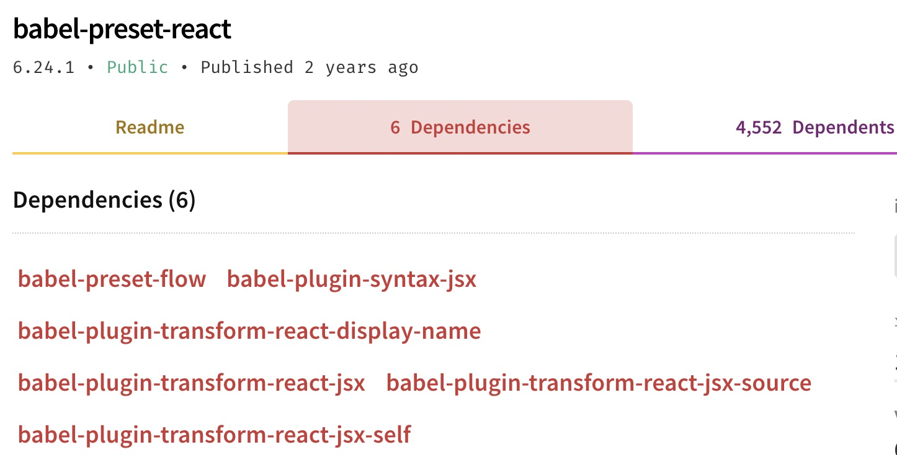

# -

[傻傻分不清之-——-babel-全家桶](https://vince.xin/2019/06/29/%E5%82%BB%E5%82%BB%E5%88%86%E4%B8%8D%E6%B8%85%E4%B9%8B-%E2%80%94%E2%80%94-babel-%E5%85%A8%E5%AE%B6%E6%A1%B6/)

babel 是一个强大的工具，它包含非常多的包，具体都是用来做什么的呢，这篇长文或许能解答你的部分问题。

[](#babel-做了什么？ "babel 做了什么？")babel 做了什么？
-----------------------------------------

babel 的诞生给前端带来高效率的编程，为什么这么说呢？正在看该篇文章的你或多或少用了 ES6+ 的语法，并且项目打包后，代码能够很好地运行在不支持 ES6+ 语法的浏览器上，这是因为你的 ES6+ 代码被 babel 转换为 ES5 的代码，这样才能够完美地运行你的代码。

所以，babel 做的事情，就是将一种语法规范转换成另外一种你需要的语法规范，这个执行过程和步骤我们将会在以下章节里讲解。

[](#babel-执行过程 "babel 执行过程")babel 执行过程
--------------------------------------

babel 的大概运行过程为：解析字符串代码生成 AST -> 将 AST 转换为新的 AST -> 将 AST 生成字符串代码，大致的过程如图所示：

[](F6A31ABA-C2C2-4203-910F-B08C3EA1FB5B.png "image")

### [](#解析 "解析")解析

对于字符串形式的 JavaScript 代码计算机是不方便处理的，所以我们将字符串结构通过 Babylon 解析器进行词法分析、语法分析后，转换为计算机更易处理的表现形式，称为抽象语法树（AST）。

### [](#转换 "转换")转换

转换成 AST 后，其结构已经是一个树状结构，相比于字符结构，我们更易进行分析与修改，如何修改是由指定的 babel-plugin-xxx 决定的，也就是说这个过程的转换结果是由 plugin 决定的。

### [](#生成 "生成")生成

AST 经过转换后，其本质上还是 AST 结构，这个时候我们反向处理，将 AST 树状结构再次转换为字符形式，到这一步，babel 转换过程也算是结束了。

[](#使用方式 "使用方式")使用方式
--------------------

babel 在发展过程中，产生了多种使用方式，主要的由以下几种

*   在构建工具中使用，如我们最常见的 webpack 中的 babel-loader 用来转换 .js 文件
*   命令行工具中使用 babel ，如 babel-cli 就是一个命令行工具
*   在逻辑代码中使用 babel，如某些业务逻辑需要使用 babel 中的 API 进行转码，我们就能使用 babel-core
*   在命令行中直接运行「未来规范」的代码，假设本地 node 版本还不支持新的语法规范，就能使用 babel-node 在命令行中运行「新语法规范」的代码

### [](#babel-loader "babel-loader")babel-loader

babel-loader 是配合 webpack 使用的，其作用就是在 webpack 打包过程中，转换 .js 或者 .tx 的文件，我们在 weboack.config.js 中配置类似如下：
```js
module: {  
 rules: [  
 {  
 test: /.js$/,  
 exclude: /(node_modules|bower_components)/,  
 loader: 'babel-loader'  
 }  
 ]  
}  
```
当 webpack 进行 babel-loader 转换的时候，会读取 .babelrc 配置文件，.babelrc 中的内容会告知 babel-loader 如何转换代码，.babelrc 文件类似如下：

```js
{  
 "presets": [  
 "es2015",  
 "react",  
 "stage-2"  
 ],  
 "plugins": []  
 }  
```

### [](#babel-core "babel-core")babel-core

在 node 中，如果某些代码需要用到 babel 中的方法，那么就可以引入 babel-core 包，直接使用里面包含的 API，如以下代码：

```js
var babel = require('babel-core');  
  
// 字符串转码  
babel.transform('code();', options);  
// => { code, map, ast }  
  
// 文件转码（异步）  
babel.transformFile('filename.js', options, function(err, result) {  
 result; // => { code, map, ast }  
});  
  
// 文件转码（同步）  
babel.transformFileSync('filename.js', options);  
// => { code, map, ast }  
  
// Babel AST转码  
babel.transformFromAst(ast, code, options);  
// => { code, map, ast }  
```

### [](#babel-cli "babel-cli")babel-cli

babel-cli 提供 cli 命令行工具来进行转码，你可以全局安装 babel-cli，然后对目录下的文件进行转码：

`npm i babel-cli -g`

然后在目录下创建`index.js`:

```js
var a = 'vince';  
var funA = () => {  
 console.log(a)  
}  
  
funA()  
```

这个时候我们运行 `babel index.js`，发现输出还是原来的代码，这是因为你还没有指定`.babelrc` 文件，该代码用到了 ES6 的箭头函数，那么我们就需要安装指定的 plugin，`babel-plugin-transform-es2015-arrow-functions` 就是专门用来转换箭头函数的 plugin，我们在当前目录下创建 `.babelrc`:

```js
{  
 "presets": [],  
 "plugins": [  
 "transform-es2015-arrow-functions"  
 ]  
}  
```

设置好了之后别忘记下载依赖 `npm install --save-dev babel-plugin-transform-es2015-arrow-functions`，这个时候我们再次运行`babel index.js`，得到以下结果：

```js
➜  babel-cli-test babel index.js  
var a = 'vince';  
var funA = function () {  
 console.log(a);  
};  
  
funA();  
```

### [](#babel-node "babel-node")babel-node

babel-node 是 babel-cli 的一部分，它不需要单独安装，这也是一个命令行工具，相当于本地的 node 指令，只不过可以运行 ES6 的代码，因为它内置 bebel-polyfill 和 bebel-register，我们创建含有 ES6 的代码：

```js
let a = 'vince';  
let funA = () => {  
 console.log(a)  
}  
  
funA()  
```

假设你目前的 node 版本不支持 ES6 语法，直接 `node index.js` 是无法正常执行的，那么 babel-node 就是为了解决该问题，`babel-node index.js`

到这里，我们已经讲解完了 babel 的主要几种用法，下面我们将会探讨它的一些细节和周边。

[](#插件-plugin-与预设-preset "插件 plugin 与预设 preset")插件 plugin 与预设 preset
--------------------------------------------------------------------

### [](#plugin "plugin")plugin

插件就是在 babel 进行「转换」步骤时需要注入的配置，如上述的`babel-plugin-transform-es2015-arrow-functions` 来转换箭头函数的方法，这个概念也非常容易理解，也就是向 babel 工具注入转换代码的函数。

### [](#preset "preset")preset

在上述讲解中，我们已经知道了 plugin 是用来告诉 babel 工具如何转换代码，那么preset 又是什么呢？我们回忆上述用 `babel-plugin-transform-es2015-arrow-functions` 来转换箭头函数的方法，那么假设我们代码中含有 `let`、`结构赋值`、`模版字符串`等新规范，那岂不是要下载一大堆 plugin ，preset 就是为了解决该问题而诞生的。

我们看到 [babel-preset-react](https://www.npmjs.com/package/babel-preset-react)，它的文档介绍如下：

> This preset includes the following plugins/presets:  
> preset-flow  
> syntax-jsx  
> transform-react-jsx  
> transform-react-display-name

意思就是 babel-preset-react 包含了以上插件或者预设，我们从其 Dependencies 中也能看书其依赖了哪些插件与预设：

[](CEB5051C-02F0-4C08-A3A2-AEC425BDF89C.png "image")

### [](#执行顺序 "执行顺序")执行顺序

从官方文档我们可以知道的几条执行原则：

*   先执行完所有 plugin，再执行 preset。
*   多个 plugin，按照声明次序顺序执行。
*   多个 preset，按照声明次序逆序执行。

我们需要按照这个原则来编写我们的 babelrc 配置，如以下配置：

```js
{  
 "presets": ["es2015", "react", "stage-2"]  
}  
```

将按如下顺序执行：stage-2、react 然后是 es2015。

这主要的是为了确保向后兼容，因为大多数用户将 “es2015” 排在 “stage-0” 之前,我们要先将更新的语法规范转译后，再去转译旧的语法规范，这样菜确保不出错。

[](#其他重要的东西 "其他重要的东西")其他重要的东西
-----------------------------

上述是整个 babel 大体上的生态与概念，以下我将会介绍一些比较重要的插件、工具以及概念。

### [](#babel-preset-env "babel-preset-env")babel-preset-env

在介绍该 preset 之前，我们思考一个这样的场景，在你的项目中，使用到了 ES6 、ES7甚至 ES8 等新的语法规范，这样我们就要找到这三个新规范的预设，最后将代码全部打包为 ES5 规范，这个时候，你会发现打包后的文件非常的大，对用户首屏体验非常不友好。

正在你非常沮丧的时候，大数据分析师跑过来告诉你：“我们项目的目标用户是年轻人，基本上大家用的都是新型浏览器，没有几个用户还在用IE”，这个时候你灵机一动想着：“我只要兼容最近几年的浏览器版本即可，不需要再将所有的代码都打包为 ES5 规范，因为新的浏览器版本早已经支持了大部分 ES6 规范了”，然而分析完后，你会发现你要做的事情如下：

1.  分析各大浏览器厂商最近几年发布的版本，如 Chrome、 Safari、 Firefox等
2.  查阅以上版本浏览器所支持的语法规范
3.  根据上一步分析得到的规范来选择 babel 的 plugin 与 preset
4.  放弃该想法

虽然上述的分析是正确的，但是真正要实现起来是非常复杂的，所以我们基本上可以放弃，那么有没有更加“傻瓜”一点的方法了，babel-preset-env 就是为了解决该问题。

babel-preset-env 的目的是通过配置目标环境的特点，然后只做必要的转换。例如目标浏览器支持 ES6规范，那么就不需要将 ES6 转换为 ES5的，打包后的代码体积会小很多，我们看下面的配置：

```js
{  
 "presets": [  
 ["env", {  
 "targets": {  
 "browsers": ["last 2 versions", "safari >= 7"]  
 }  
 }]  
 ]  
}  
```

如上配置将考虑所有浏览器的最新2个版本( safari 大于等于7.0的版本)的特性，将必要的代码进行转换，而这些版本已有的功能就不进行转化了，具体配置我们可以参考 [browserslist](https://github.com/browserslist/browserslist) 。

假设我们不屑任何配置项，其默认会给我们配置 es2015 + es2016 + es2017 + es2018 + …(esNOW)，那么就意味着将代码全部转换为 ES5 规范。

### [](#babel-register "babel-register")babel-register

### [](#babel-polyfill "babel-polyfill")babel-polyfill

babel 默认只会转换语法规范，但是不会在代码里面注入新的 API ，比如 Generator、Set、Maps 等全局对象，也不会在全局对象上加入新的方法（如Object.assign），即当你使用 `Object.assign` 时，是不会进行转换的。

babel-polyfill 就是为了解决这个问题，使用时，在所有运行代码之前增加 require(‘babel-polyfill)，或者如果你使用 webpack 作为打包工具，直接在 webpack.config.js 中将 babel-polyfill 放在 entry 第一个位置，并且 babel-polyfill 是作为 dependencies 而不是 devDependencies 。

当你这么做后，你会发现打包后的文件非常大，这是因为 babel-polyfill 实现了很多种 API，不管你用几个这里面的 API，都会给你打包进去，所以 babel-polyfill 有以下缺点：

1.  并不是按需加载，打包出的文件非常大。
2.  污染全局变量，在很多原型链上都做了修改，这种情况会非常不可控。

因此，在这个时间点，使用 babel-polyfill 已经不再是那么优雅了，因为我们已经有新的方案可以替代了。

### [](#babel-runtime-amp-babel-plugin-transform-runtime "babel-runtime & babel-plugin-transform-runtime")babel-runtime & babel-plugin-transform-runtime

我们先来看一个例子，我们需要转换以下代码:

```js
class Foo {  
 method() {}  
}  
```

配置 .babelrc ：  

```js
{  
 "plugins": [  
 "transform-es2015-classes"  
 ],  
 "presets": []  
}  
```

转换后的代码如下：

```js
var _createClass = function () { // ... 很长的代码 }();  
  
function _classCallCheck(instance, Constructor) {   
 // ... 很长的代码  
}  
  
let Foo = function () {  
 function Foo() {  
 _classCallCheck(this, Foo);  
 }  
  
 _createClass(Foo, [{  
 key: "method",  
 value: function method() {}  
 }]);  
  
 return Foo;  
}();  
```

那么我们加入每个文件都用到了 class ，打包后就会有非常多的重复冗余的代码， babel-plugin-transform-runtime 就是来解决这件事情的。

我们安装依赖：

```js
$ npm install --save-dev babel-plugin-transform-runtime  
$ npm install --save babel-runtime  
```

改变 .babelrc :

```js
{  
 "plugins": [  
 "transform-runtime",  
 "transform-es2015-classes"  
 ],  
 "presets": []  
}  
```

打包后的代码将会是以下结果：

```js
import _classCallCheck from "babel-runtime/helpers/classCallCheck";  
import _createClass from "babel-runtime/helpers/createClass";  
  
let Foo = function () {  
 function Foo() {  
 _classCallCheck(this, Foo);  
 }  
  
 _createClass(Foo, [{  
 key: "method",  
 value: function method() {}  
 }]);  
  
 return Foo;  
}();  
```

这样就不需要把 _classCallCheck 和 _createClass 这两个助手方法放进每一个需要的文件里去了。

我们别忘了还有 babel-runtime 这个东西，那么这又是用来干嘛的呢，我们看上面代码头部，从 babel-runtime 里面引入了方法，那么 babel-runtime 就是集成了很多内置类或者方法，它主要集成了以下：

1.  core-js: 转换一些内置类 (Promise, Symbols等等) 和静态方法 (Array.from 等)。绝大部分转换是这里做的。自动引入。
2.  regenerator: 主要是 generator/yield 和 async/await 两组的支持。当代码中有使用 generators/async 时自动引入。
3.  helpers, 如 asyncToGenerator、jsx, classCallCheck 等等方法，具体可以查看 babel-helpers。

[](#总结 "总结")总结
--------------

babel 是整个前端视为几大巨头之一的工具，给我们开发过程带来了革命性的改变，随着 JavaScript 语言的演进，babel 也在进行不断的发展。本篇文章我们讲述了 babel 中几个非常重要的概念与工具，想要更加深入地探索 babel 光从概念来学习是不够的，还需要在实际开发中不断的实践与试错，才能优雅地用上 babel 。