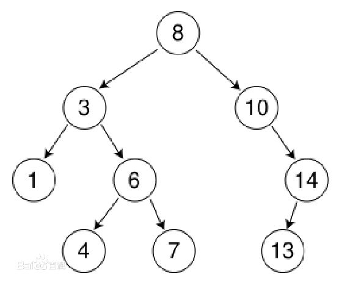

#### js实现二叉树

1、二叉树的定义

 > 二叉树是每个结点最多有两个子树的树结构。通常子树被称作“左子树”（left subtree）和“右子树”（right subtree）。二叉树常被用于实现二叉查找树和二叉堆。
一棵深度为k，且有2^k-1个节点的二叉树，称为满二叉树。这种树的特点是每一层上的节点数都是最大节点数。而在一棵二叉树中，除最后一层外，若其余层都是满的，并且最后一层或者是满的，或者是在右边缺少连续若干节点，则此二叉树为完全二叉树。具有n个节点的完全二叉树的深度为floor(log2n)+1。深度为k的完全二叉树，至少有2k-1个叶子节点，至多有2k-1个节点。

排序二叉树
>又称二叉查找树（Binary Search Tree），亦称二叉搜索树。二叉排序树或者是一棵空树，或者是具有下列性质的二叉树：
- 若左子树不空，则左子树上所有结点的值均小于它的根结点的值；
- 若右子树不空，则右子树上所有结点的值均大于它的根结点的值；
- 左、右子树也分别为二叉排序树；
- 没有键值相等的节点。

2、排序二叉树的创建

传入一个没有重复元素的数组，返回排序二叉树

	var nodes = [8,3,10,1,6,11,2,9,12];

算法的核心思想：比较要插入的节点和根节点的大小，如果比根节点小，就走左子树，否则，走右子树。因为二叉树的任意子树，也是一个二叉树，所以可以使用递归的方式来构建二叉树

3、中序遍历二叉树

 >首先中序遍历左（右）子树，再访问根，最后中序遍历右（左）子树, 判断二叉树是否有左子树，如果有，就去遍历左子树，没有，就输出根节点，并遍历右子树
 - 1 2 3 6 8 9 10 11 12

4、先序遍历二叉树

>首先访问根，再先序遍历左（右）子树，最后先序遍历右（左）子树, 复制二叉树的时候，先序遍历的效率最高

 - 8 3 1 2 6 10 9 11 12

5、后续遍历二叉树

 >首先后序遍历左（右）子树，再后序遍历右（左）子树，最后访问根, 用于文件系统的遍历
 - 2 1 6 3 9 12 11 10 8

6、二叉树查询

 - 显然，比根节点小的节点在根节点的左边，比根节点大的节点在根节点的右边。通过比较大小，就可以快速找到我们想要的节点是否存在。