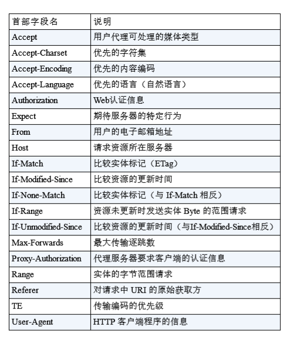

# 《图解 http 》读书笔记

本书是一位日本人写的，我很喜欢这本书的表达方式 —— 突出重点、浅显易懂！很符合我经常说的 2/8 原则。如果感觉看着不过瘾，还可以去阅读更加高大上的《 HTTP 权威指南》，厚厚的枕头书。不过，我感觉作为一名前端程序猿，仔细看看这本书就够了。

----

## 第一章 了解Web及网络基础

网络（包括互联网）都是建立在 **TCP/IP 协议族** 基础上的，其中常见的具体协议有 http ftp ssh dns TCP IP等，http 协议仅仅是其中的一个子集。先了解出处和来源。

### 三次握手

为了准确无误地将数据送达目标处，TCP 协议采用了三次握手 （three-way handshaking）策略。用 TCP 协议把数据包送出去后，TCP 不会对传送后的情况置之不理，它一定会向对方确认是否成功送达。

握手过程中使用了 TCP 的标志`（flag） —— SYN（synchronize）` 和 `ACK（acknowledgement）`。 发送端首先发送一个带 SYN 标志的数据包给对方。接收端收到后， 回传一个带有 `SYN/ACK` 标志的数据包以示传达确认信息。最后，发送端再回传一个带 ACK 标志的数据包，代表“握手”结束。 若在握手过程中某个阶段莫名中断，TCP 协议会再次以相同的顺序发送相同的数据包。

- 第一次，发送端发送标有SYN的数据包到接收端，要求建立连接
- 第二次，接收端收到，然后发送SYN/ACK数据包回去，表明可以建立连接
- 第三次，发送端收到并检查返回的信息，若信息正确，再发送带有ACK的数据包到接收端

PS：**http 1.1 版本开始支持持久连接`Connection: keep-alive`**，只要连接双方不明确终点连接，连接就会持续保持，即每次发送数据无需再进行“三次握手”

### 临时想到的

> 按照 TCP/IP 协议族的层次划分，TCP 位于传输层，提供可靠的字节流服务。所谓字**节流服务（Byte Stream Service）**是指，为了方便传输，将大块数据分割成以报文段（segment）为代为的数据包就行管理。

读到书中这段文字（12页），想到了一个关于数据**结构化和非结构化**的话题，需要分开来说：

- **存储 & 传输：非结构化数据**，例如上文提到的传输过程中的字节流服务（在 nodejs 中的 Stream 会有更贴切的体现），再如存储为文件的文本、图片、视频等。非结构化的数据无法用户复杂计算。
- **计算：结构化数据**，进行复杂的逻辑运算，前提是需要结构化的数据，因此学习算法之前要先学习数据结构。这样就涉及到非结构和结构化相互转换的一个问题，最简单的示例就是`JSON.parse`和`JSON.stringify`

### 各种协议与 HTTP 协议的关系


----

### URI 和URL

#### URI 　统一资源标识符

URI 就是由某个协议方案表示的资源的定位标识符。协议 方案是指访问资源所使用的协议类型名称。

采用 HTTP 协议时，协议方案就是 http。除此之外，还有 ftp、
mailto、telnet、file 等。

URI 用字符串标识某一互联网资源，而 URL 表示资源的地点（互联 网上所处的位置）。可见 URL 是 URI 的子集

“RFC3986：统一资源标识符（URI）通用语法”中列举了几种 URI 例 子，如下所示。

```TXT
ftp://ftp.is.co.za/rfc/rfc1808.txt 

http://www.ietf.org/rfc/rfc2396.txt 

ldap://[2001:db8::7]/c=GB?objectClass?one 

mailto:John.Doe@example.com 

news:comp.infosystems.www.servers.unix 

tel:+1-816-555-1212 telnet://192.0.2.16:80/ 

urn:oasis:names:specification:docbook:dtd:xml:4.1.2
```

#### URI 格式 

- 绝对URI


**片段标识符**

使用片段标识符通常可标记出已获取资源中的子资源（文档内的某个 位置）。但在 RFC 中并没有明确规定其使用方法。该项也为可选 项。

并不是所有的应用程序都符合 RFC 有一些用来制定 HTTP 协议技术标准的文档，它们被称为 **RFC（Request for Comments，征求修正意见书）**。 通常，应用程序会遵照由 RFC 确定的标准实现。可以说，RFC 是 互联网的设计文档，要是不按照 RFC 标准执行，就有可能导致无 法通信的状况。

## 第二章 简单的HTTP 协议

这一章主要理解HTTP协议的基础

HTTP 协议和 TCP/IP 协议族内的其他众多的协议相同，用于客户端和 服务器之间的通信。

请求访问文本或图像等资源的一端称为客户端，而提供资源响应的一 端称为服务器端。

HTTP 协议规定，请求从客户端发出，最后服务器端响应该请求并返 回。

### 无状态协议

HTTP 是一种不保存状态，即无状态（stateless）协议。HTTP 协议自 身不对请求和响应之间的通信状态进行保存

协议本身并不保留之前一切的请求或响应报文的信息。这是为了 更快地处理大量事务，确保协议的可伸缩性，而特意把 HTTP 协议设 计成如此简单的。

可是，随着 Web 的不断发展，因无状态而导致业务处理变得棘手的 情况增多了。比如，用户登录到一家购物网站，即使他跳转到该站的

其他页面后，也需要能继续保持登录状态。针对这个实例，网站为了 能够掌握是谁送出的请求，需要保存用户的状态。
HTTP/1.1 虽然是无状态协议，但为了实现期望的保持状态功能，于 是引入了 Cookie 技术。

### http 报文构成内容

请求报文是由请求方法、请求 URI、协议版本、可选的请求首部字段 和内容实体构成的


上图是 request 的报文图解，内容有：

- **Method**
- URI
- 协议版本
- **Head 头部字段**
- 内容实体


上图是 response 的报文图解，内容有：

- 协议版本
- **状态码**
- 状态码的原因短语
- **Head 头部字段**
- 主体内容

PS：报文内容中，头部内容和主体内容是通过 **空行（CR+LF）** 区分开来的。

----

### Method

> 和 Method 比较相关的新概念是 RESTful API ，可去查阅相关的资料，本文不展开。

常用的 Method 有两种：

- `GET` 获取信息
- `POST` 传输信息

其他 Method

- `PUT` 传输文件。自身不带验证机制，存在安全问题，一般的 web 网站不推荐使用
- `HEAD` 获取 Head 信息。不返回报文主体。用于确认 URI 有效性即资源更新的日期时间等
- `DELETE` 删除文件。跟`PUT`一样，不安全

还有 `OPTIONS` `TRACE` `CONNECT` 等，不常用。


### 持久连接 HTTP Persistent Connections

HTTP/1.1 和一部分的 HTTP/1.0 想出了 持久连接（HTTP Persistent Connections，也称为 HTTP keep-alive 或 HTTP connection reuse）的方法。持久连接的特点是，只要任意一端 没有明确提出断开连接，则保持 TCP 连接状态。


图：持久连接旨在建立 1 次 TCP 连接后进行多次请求和响应的交 互

持久连接的好处在于减少了 TCP 连接的重复建立和断开所造成的额 外开销，减轻了服务器端的负载。另外，减少开销的那部分时间，使 HTTP 请求和响应能够更早地结束，这样 Web 页面的显示速度也就相 应提高了。

**在 HTTP/1.1 中，所有的连接默认都是持久连接，但在 HTTP/1.0 内并 未标准化。虽**然有一部分服务器通过非标准的手段实现了持久连接， 但服务器端不一定能够支持持久连接。毫无疑问，除了服务器端，客 户端也需要支持持久连接。

### 管线化 pipelining

持久连接使得多数请求以管线化（pipelining）方式发送成为可能。从 前发送请求后需等待并收到响应，才能发送下一个请求。管线化技术 出现后，不用等待响应亦可直接发送下一个请求。

这样就能够做到同时并行发送多个请求，而不需要一个接一个地等待 响应了。


图：不等待响应，直接发送下一个请求

### 使用 Cookie 的状态管理

Cookie 技术通过在请求和响应报文中写入 Cookie 信 息来控制客户端的状态。

Cookie 会根据从服务器端发送的响应报文内的一个叫做 `Set-Cookie` 的 首部字段信息，通知客户端保存 Cookie。当下次客户端再往该服务器 发送请求时，客户端会自动在请求报文中加入 Cookie 值后发送出 去。

服务器端发现客户端发送过来的 Cookie 后，会去检查究竟是从哪一 个客户端发来的连接请求，然后对比服务器上的记录，最后得到之前 的状态信息。

1. 请求报文（没有 Cookie 信息的状态）

```
GET /reader/ HTTP/1.1
Host: hackr.jp
*首部字段内没有Cookie的相关信息
```

2. 响应报文（服务器端生成 Cookie 信息）

```
HTTP/1.1 200 OK
Date: Thu, 12 Jul 2012 07:12:20 GMT
Server: Apache
＜Set-Cookie: sid=1342077140226724; path=/; expires=Wed, 10-Oct-12 07:12:20 GMT＞
Content-Type: text/plain; charset=UTF-8
```

3. 请求报文（自动发送保存着的 Cookie 信息）

```
GET /image/ HTTP/1.1
Host: hackr.jp
Cookie: sid=1342077140226724
```

----

## 第三章 HTTP 报文内的 HTTP 信息

### HTTP 报文

用于 HTTP 协议交互的信息被称为 HTTP 报文。请求端（客户端）的 HTTP 报文叫做请求报文，响应端（服务器端）的叫做响应报文。 HTTP 报文本身是由多行（用 CR+LF 作换行符）数据构成的字符串文 本。

HTTP 报文大致可分为报文首部和报文主体两块。两者由最初出现的 空行（CR+LF）来划分。通常，并不一定要有报文主体。

请求报文和响应报文的首部内容由以下数据组成

请求行

包含用于请求的方法，请求 URI 和 HTTP 版本。

状态行

包含表明响应结果的状态码，原因短语和 HTTP 版本。

首部字段

包含表示请求和响应的各种条件和属性的各类首部。

一般有 4 种首部，分别是：通用首部、请求首部、响应首部和实体首部。

### 编码提升传输速率

HTTP 在传输数据时可以按照数据原貌直接传输，但也可以在传输过 程中通过编码提升传输速率。通过在传输时编码，能有效地处理大量 的访问请求。但是，编码的操作需要计算机来完成，因此会消耗更多 的 CPU 等资源

#### 内容编码

常用的内容编码有以下几种

-- gzip（GNU zip）

- compress（UNIX 系统的标准压缩）

- deflate（zlib）

- identity（不进行编码）

#### 分割发送的分块传输编码

在 HTTP 通信过程中，请求的编码实体资源尚未全部传输完成之前， 浏览器无法显示请求页面。在传输大容量数据时，通过把数据分割成 多块，能够让浏览器逐步显示页面。

这种把实体主体分块的功能称为分块传输编码（Chunked Transfer Coding）。

分块传输编码会将实体主体分成多个部分（块）。每一块都会用十六 进制来标记块的大小，而实体主体的最后一块会使用“0(CR+LF)”来标 记。

使用分块传输编码的实体主体会由接收的客户端负责解码，恢复到编 码前的实体主体。

HTTP/1.1 中存在一种称为传输编码（Transfer Coding）的机制，它可 以在通信时按某种编码方式传输，但只定义作用于分块传输编码中。

#### 发送多种数据的多部分对象集合

发送邮件时，我们可以在邮件里写入文字并添加多份附件。这是因为 采用了 MIME（Multipurpose Internet Mail Extensions，多用途因特网邮 件扩展）机制，它允许邮件处理文本、图片、视频等多个不同类型的数据。

HTTP 协议中也采纳了多部分对象集合，发送的一份报文主 体内可含有多类型实体。通常是在图片或文本文件等上传时使用。

- multipart/form-data 在 Web 表单文件上传时使用。 
- multipart/byteranges 状态码 206（Partial Content，部分内容）响应报文包含了多个范 围的内容时使用。

#### 获取部分内容的范围请求

以前，用户不能使用现在这种高速的带宽访问互联网，当时，下载一 个尺寸稍大的图片或文件就已经很吃力了。如果下载过程中遇到网络 中断的情况，那就必须重头开始。为了解决上述问题，需要一种可恢 复的机制。所谓恢复是指能从之前下载中断处恢复下载。

要实现该功能需要指定下载的实体范围。像这样，指定范围发送的请 求叫做范围请求（Range Request）

#### 内容协商返回最合适的内容

当浏览器的默认语言为英语或中文，访问相同 URI 的 Web 页面时， 则会显示对应的英语版或中文版的 Web 页面。这样的机制称为内容 协商（Content Negotiation）。

内容协商机制是指客户端和服务器端就响应的资源内容进行交涉，然 后提供给客户端最为适合的资源。内容协商会以响应资源的语言、字 符集、编码方式等作为判断的基准。

包含在请求报文中的某些首部字段（如下）就是判断的基准

- Accept
- Accept-Charset
- Accept-Encoding
- Accept-Language
- Content-Language

内容协商技术有以下 3 种类型

- 服务器驱动协商（Server-driven Negotiation）
- 客户端驱动协商（Agent-driven Negotiation）
- 透明协商（Transparent Negotiation）

## 第四章 http 状态码

状态码的职责是当客户端向服务器端发送请求时，描述返回的请求结 果。借助状态码，用户可以知道服务器端是正常处理了请求，还是出 现了错误。


**只要遵守状态码类别的定义，即使改变 RFC2616 中定义的状态码， 或服务器端自行创建状态码都没问题。**

- `1xx` 请求正在处理
- `2xx` 成功
- `3xx` 重定向
- `4xx` 客户端错误
- `5xx` 服务端错误

以上是状态码的分类。书中提到，全部的状态码总共有 60 多种，但实际常用的就 14 种（其实常用的不到 14 种）。下面分类别简述：

### `1xx`

无

### `2xx`

- `200` 成功
- `204 No Content` 成功，但在返回的响应报文中 不含实体的主体部分。另外，也不允许返回任何实体的主体。一般用于只往客户端发送信息，而不需要客户端返回内容的情况（不常见）。
- `206 Partial Content` 范围请求，不是全部。用 Head 中的`Content-Range`来指定范围。

### `3xx`

3XX 响应结果表明浏览器**需要执行某些特殊的处理以正确处理请求**。

- `301Moved Permanently` 永久重定向。如`http://xxx.com`这个 Get 请求（最后没有`/`），就会被`301`到`http://xxx.com/`（最后是`/`）
- `302 Found` 临时重定向。临时的，不是永久的。
- `303 See Other` 临时重定向 303 状态码明确 表示客户端应当采用 GET 方法获取资源

> 当 301、302、303 响应状态码返回时，几乎所有的浏览器都会把 POST 改成 GET，并删除请求报文内的主体，之后请求会自动再次 发送。
301、302 标准是禁止将 POST 方法改变成 GET 方法的，但实际使 用时大家都会这么做

- `304 Not Modified` 资源找到但是不符合请求条件，不会返回任何主体。如发送 GET 请求时，head 中有`If-Modified-Since: xxx`（要求返回更新时间是`xxx`时间之后的资源），如果此时 server 端资源未更新，则会返回`304`，即不符合要求。

- `307 Temporary Redirect ` 临时重定向。该状态码与 302 Found 有着相同的含义。 302 标准禁止 POST 变换成 GET，但实际使用时大家并不遵守。 307 会遵照浏览器标准，不会从 POST 变成 GET。但是，对于处理响 应时的行为，每种浏览器有可能出现不同的情况。

### `4xx`

4XX 的响应结果表明客户端是发生错误的原因所在。

- `400 Bad Request` 该状态码表示请求报文中存在语法错误。当错误发生时，需修改请求 的内容后再次发送请求。另外，浏览器会像 200 OK 一样对待该状态 码。

- `401 Unauthorized` 表示发送的请求需要有通过 HTTP 认证（BASIC 认证、 DIGEST 认证）的认证信息。另外若之前已进行过 1 次请求，则表示 用 户认证失败。

- `403  Forbidden` 被拒绝，例如外域图片盗链。该状态码表明对请求资源的访问被服务器拒绝了。服务器端没有必要 给出拒绝的详细理由，但如果想作说明的话，可以在实体的主体部分对原因进行描述，这样就能让用户看到了。

- `404  Not Found` 请求资源未找到。该状态码表明服务器上无法找到请求的资源。除此之外，也可以在服 务器端拒绝请求且不想说明理由时使用。

### `5xx`

5XX 的响应结果表明服务器本身发生错误

- `500 Internal Server Error` 服务器执行请求期间发生错误，如程序出现 bug或某些临时的故障。
- `503 Service Unavailable` 服务器暂时超负载或者维护停机

----

## 第五章 Web服务器

即使物理层面只有一台服务器，但只要使用虚拟主机机（Virtual Host，又称虚拟服务器）的功能，则可以 假想已具有多台服务器。

HTTP 通信时，除客户端和服务器以外，还有一些用于通信数据转发 的应用程序，例如代理、网关和隧道。它们可以配合服务器工作。

这些应用程序和服务器可以将请求转发给通信线路上的下一站服务 器，并且能接收从那台服务器发送的响应再转发给客户端。

- 代理 代理是一种有转发功能的应用程序，它扮演了位于服务器和客户 端“中间人”的角色，接收由客户端发送的请求并转发给服务器，同时 也接收服务器返回的响应并转发给客户端。

- 网关 网关是转发其他服务器通信数据的**服务器**，接收从客户端发送来的请 求时，它就像自己拥有资源的源服务器一样对请求进行处理。有时客 户端可能都不会察觉，自己的通信目标是一个网关。

- 隧道 隧道是在相隔甚远的客户端和服务器两者之间进行中转，并保持双方 通信连接的应用程序。

### 代理

使用代理服务器的理由有：**利用缓存技术（稍后讲解）减少网络带宽 的流量，组织内部针对特定网站的访问控制，以获取访问日志为主要 目的，等等。**

代理服务器的基本行为就是接收客户端发送的请求后转发给其他服务 器。代理不改变请求 URI，会直接发送给前方持有资源的目标服务器。**持有资源实体的服务器被称为源服务器**。从源服务器返回的响应经过代理服务器后再传给客户端

**代理有多种使用方法，按两种基准分类。一种是是否使用缓存，另一 种是是否会修改报文。**

#### 缓存代理

代理转发响应时，缓存代理（Caching Proxy）会预先将资源的副本 （缓存）保存在代理服务器上。

当代理再次接收到对相同资源的请求时，就可以不从源服务器那里获 取资源，而是将之前缓存的资源作为响应返回。

### 透明代理

转发请求或响应时，不对报文做任何加工的代理类型被称为透明代理 （Transparent Proxy）。反之，对报文内容进行加工的代理被称为非 透明代理。

### 网关


图：利用网关可以由 HTTP 请求转化为其他协议通信

网关的工作机制和代理十分相似。而网关能使通信线路上的服务器提 供非 HTTP 协议服务。

利用网关能提高通信的安全性，因为可以在客户端与网关之间的通信 线路上加密以确保连接的安全。比如，网关可以连接数据库，使用 SQL 语句查询数据。另外，在 Web 购物网站上进行信用卡结算时， 网关可以和信用卡结算系统联动。

### 隧道


图：通过隧道的传输，可以和远距离的服务器安全通信。隧道本 身是透明的，客户端不用在意隧道的存在

隧道可按要求建立起一条与其他服务器的通信线路，届时使用 SSL 等 加密手段进行通信。隧道的目的是确保客户端能与服务器进行安全的 通信。

隧道本身不会去解析 HTTP 请求。也就是说，请求保持原样中转给之 后的服务器。隧道会在通信双方断开连接时结束。

---
>在 HTTP 出现之前的协议 在 HTTP 普及之前，也就是从互联网的诞生期至今，曾出现过各式 各样的协议。在 HTTP 规范确立之际，制定者们参考了那些协议的 功能。也有某些协议现在已经彻底退出了人们的视线。接下来，我 们会简单介绍一下这些协议。

- FTP（File Transfer Protocol） 传输文件时使用的协议。该协议历史久远，可追溯到 1973 年前 后，比 TCP/IP 协议族的出现还要早。虽然它在 1995 年被 HTTP 的 流量（Traffic）超越，但时至今日，仍被广泛沿用。

- NNTP（Network News Transfer Protocol） 用于 NetNews 电子会议室内传送消息的协议。在 1986 年前后出 现，属于比较古老的一类协议。现在，利用 Web 交换信息已成主 流，所以该协议已经不怎么使用了。

- Archie 搜索 anonymous FTP 公开的文件信息的协议。1990 年前后出现，现 在已经不常使用。

- WAIS（Wide Area Information Servers） 以关键词检索多个数据库使用的协议。1991 年前后出现。由于现 在已经被 HTTP 协议替代，也已经不怎么使用了。 Gopher 查找与互联网连接的计算机内信息的协议。1991 年前后出现，由 于现在已经被 HTTP 协议替代，也已经不怎么使用了。

---

## 第六章 http head（首部）

分类：

- 通用首部字段（General Header Fields）（即请求和相应都会用到）
- 请求首部字段（Request Header Fields）
- 响应首部字段（Response Header Fields）
- 实体首部字段（Entity Header Fields）

HTTP 首部字段是由首部字段名和字段值构成的，中间用冒号“:” 分隔，字段值对应单个 HTTP 首部字段可以有多个值。

首部字段名: 字段值

在 HTTP 协议通信交互中使用到的首部字段，不限于 RFC2616 中定 义的 47 种首部字段。还有 Cookie、Set-Cookie 和 Content-Disposition 等在其他 RFC 中定义的首部字段，它们的使用频率也很高。

这些非正式的首部字段统一归纳在 RFC4229 HTTP Header Field Registrations 中。

下面按照分类介绍一些常用的字段，不常用的略过。

### 通用首部字段


- **`Cache-Control` 缓存控制**

字段值非常多。工作中一个例子，加载 CDN 一个 JS 的时候，request 时候`Cache-Control:no-cache`，response 时候`Cache-Control:max-age=3600`（资源缓存周期是 1h）

>从字面意思上很容易把 no-cache 误解成为不缓存，但事实上 no-cache 代表不缓 存过期的资源，缓存会向源服务器进行有效期确认后处理资源，也许称为 do-notserve-from-cache-without-revalidation 更合适。no-store 才是真正地不进行缓存，请 读者注意区别理解。——译者注

- **`Connection`**

一般用于管理持久连接，request 和 response 都是`Connection: keep-alive`

- **`Date` 时间**

即 request 和 response 的时间。记得很早之前有人问到，像那种定时秒杀抢购这种场景，肯定需要用服务器端时间，**那么客户端如何以最小的代价获取服务器端时间？** 答案就是用这里的`Date`字段，如果再弄一个 API 专门返回时间，那就慢很多了。

### 请求首部字段



客户端发出 http 请求时，这些信息将被 server 端接收。

- **`Accept` 可接收类型**

客户端接收的媒体类型，如加载 html 时`Accept: text/html,application/xhtml+xml,application/xml`，加载图片时`Accept: image/webp,image/apng,image/*,*/*;q=0.8`，无要求就直接`Accept:*/*`。

上面的这些可选值，如`text/html` `image/webp` 都是标准的 MIME 类型，全部类型参考 [这里](http://www.w3school.com.cn/media/media_mimeref.asp) 或者网上搜索“MIME 类型”。

- **`Accept-Encoding`**

如`Accept-Encoding: gzip, deflate, br`，其中`gzip`是常用的压缩格式，表明客户端支持`gzip`压缩。`gzip`压缩能记得缩减资源大小，以 JS 为例，可压缩至原大小的 1/3 左右。

- **`Accept-Language` 语言**

如`Accept-Language:zh-CN,zh;q=0.9,en;q=0.8,und;q=0.7`，优先中文、英文次之，在多语言系统中可用。

- **`Host` 域**

如`Host: m.baidu.com`，包括域和端口号，不包括协议。

- **`If-Modified-Since`**

`If-Modified-Since: xxx`即要求资源必须是`xxx`时间之后修改过的，返回`200`。如果是找到资源，但是资源修改时间是`xxx`时间之前的，返回`304`（没有任何实体内容）

- **`Referer` 来源**

如`Referer:https://m.baidu.com/`，即该请求来自于哪里。

- **`Range` 范围**

如`Range: bytes:5001-10000`

- **`User-Agent` UA**

每次 http 请求，都将 UA 传递到 server 。注意，**UA 没有跨域限制，请求第三方 http ，也会传递 UA** 。

- **`Cookie`**

每次 http 请求，都将 cookie 传递给 sever 。注意，**cookie 有跨域限制，只有同源才会传递 cookie**  。

### 响应首部字段


server 端返回 http 请求时，这些信息将被客户端接收。

- **`Age` 缓存持续时长**

如`Age: 300`，即说明该资源缓存是在 300s 之前创建的。可以拿来和`Cache-Control:max-age=3600`进行对比。

- **`ETag`**

如`ETag: xxx`。`ETag`是服务端为每个资源分配的唯一的值，资源更新`ETag`也会更新。`ETag`并没有统一的算法，由 server 端自行控制。

`ETag`会用于 request Head 中的`If-Match`字段，不过我在实际工作中尚未用过该字段。

- **`Location` 重定向地址**

当返回`3xx`状体码时，要配合返回重定向的地址。

- **`Server` 服务信息**

如`Server: Apache`，可能是服务器名称，可能是名称 + 版本号，也可能是自定义的某个值

- **`Set-Cookie`**

是本次 http 请求中 server 端设置的 cookie 信息。除了 cookie 内容本身之外，还有`expires` `patch` `domain` `Secure`（仅用于 https） `HttpOnly`（JS 不能访问）这些信息。

如本次请求是申请登录，如果登录成功的话，server 端肯定要使用`Set-Cookie`在 cookie 中增加`sessionid=xxxx`，并且使用`HttpOnly`和`expires`。

注意，**设置`domain`可能会造成主域名的 cookie 污染**。如果指定`domain=example.com`时，`sub.example.com`的页面也会有效。

### 实体首部字段


request 和 response 中，实体部分所使用的首部字段。

- **`Content-Encoding`**

如`Content-Encoding: gzip`，实体使用 gzip 压缩。

- **`Content-Length`**

如`Content-Length: 967`，实体部分的大小，单位是 字节 。

- **`Content-Type`**

如`Content-Type: application/x-javascript`，其他信息可参考`Accept`字段。

- **`Expires`**

如`Expires: Thu, 22 Feb 2018 03:03:12 GMT`，即该资源即将失效的时间。

----

## 第七章 https

http 请求是明文传输，因此内容被窃听是分分钟的事，因此要谨慎使用那些免费的 wifi 和 vpn 等。解决方式就是使用 https 。https 传输的数据是经过加密保护的，没有正式将无法被阅读，这也给 debug 时候抓包带来了一定成本。

未加密的协议一般都会有这样的问题：

- 通信使用明文（不加密），内容可能会被窃听
- 不验证通信方的身份，因此有可能遭遇伪装
- 无法证明报文的完整性，所以有可能已遭篡

**`HTTP + 加密 + 认证 + 完整性保护 = HTTPS`**

HTTPS 并非是应用层的一种新协议。只是 HTTP 通信接口部分用 SSL（Secure Socket Layer）和 TLS（Transport Layer Security）协议代 替而已。

通常，HTTP 直接和 TCP 通信。当使用 SSL 时，则演变成先和 SSL 通 信，再由 SSL 和 TCP 通信了。简言之，所谓 HTTPS，其实就是身披 SSL 协议这层外壳的 HTTP。

在采用 SSL 后，HTTP 就拥有了 HTTPS 的加密、证书和完整性保护 这些功能。

SSL 是独立于 HTTP 的协议，所以不光是 HTTP 协议，其他运行在应 用层的 SMTP 和 Telnet 等协议均可配合 SSL 协议使用。**可以说 SSL 是 当今世界上应用最为广泛的网络安全技术。**

----

## 第八章确认访问用户身份的认证

### HTTP 使用的认证方式

HTTP/1.1 使用的认证方式如下所示

- BASIC 认证（基本认证）
- DIGEST 认证（摘要认证）
- SSL 客户端认证
- FormBase 认证（基于表单认证）

此外，还有 Windows 统一认证（Keberos 认证、NTLM 认证），但本 书不作讲解

### SSL 客户端认证

从使用用户 ID 和密码的认证方式方面来讲，只要二者的内容正确， 即可认证是本人的行为。但如果用户 ID 和密码被盗，就很有可能被 第三者冒充。利用 SSL 客户端认证则可以避免该情况的发生。

SSL 客户端认证是借由 HTTPS 的客户端证书完成认证的方式。凭借 客户端证书（在 HTTPS 一章已讲解）认证，服务器可确认访问是否 来自已登录的客户端。

### 认证多半为基于表单认证

由于使用上的便利性及安全性问题，HTTP 协议标准提供的 BASIC 认 证和 DIGEST 认证几乎不怎么使用。另外，SSL 客户端认证虽然具有 高度的安全等级，但因为导入及维持费用等问题，还尚未普及。

比如 SSH 和 FTP 协议，服务器与客户端之间的认证是合乎标准规范 的，并且满足了最基本的功能需求上的安全使用级别，因此这些协议 的认证可以拿来直接使用。但是对于 Web 网站的认证功能，能够满 足其安全使用级别的标准规范并不存在，所以只好使用由 Web 应用 程序各自实现基于表单的认证方式。

不具备共同标准规范的表单认证，在每个 Web 网站上都会有各不相 同的实现方式。如果是全面考虑过安全性能而实现的表单认证，那么 就能够具备高度的安全等级。但在表单认证的实现中存在问题的 Web 网站也是屡见不鲜。

## 第九章 基于 HTTP 的功能追加 协议

- SPDY
- Ajax
- Comet
- WebSocket
- HTTP/2.0
- WebDAV
